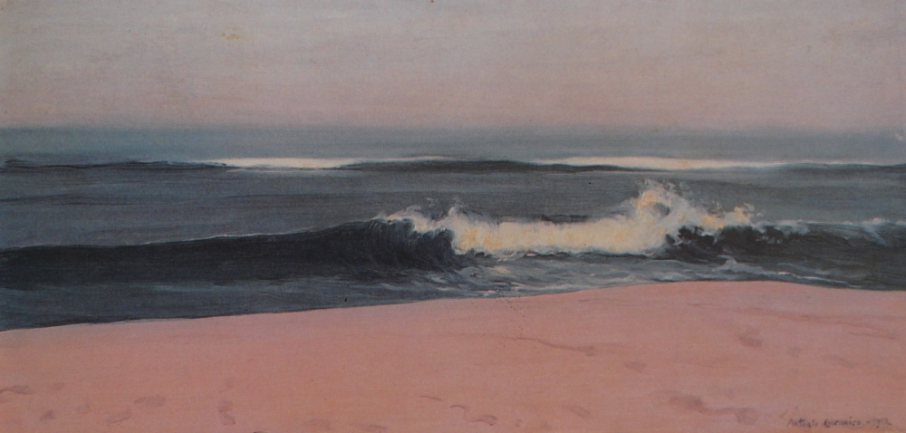

# Lisbon to Oerias (Thursday March 22nd) #

The sky is clear and blue. The first day I have seen like this in weeks. A good day to start a journey I think. I wander along the wall of the marina to talk to Luís, who is operating the sluices. Seeing the electricity adaptor in my hands he knows that I have come for my deposit. Five minutes he tells me. We chat about the weather in Portuguese while we wait for the sluices to open. We walk back together and he opens the reception.

 Luís shakes the envelope that has been left on the counter to see if there is more money, but alas there is only the €30 euros that I'm due. He picks up his clipboard and tells me that he will come with me. I reply that this is not necessary as I will still be about 15 minutes, and that, before I go, I will radio. He sets off on his rounds where he will check each boat in the marina against those listed on the clipboard. As we part I ask him what the Portuguese word is for checklist. There is no portuguese word he tells me.

 Back on Kite I stow the last bits of gear and get us down to two dock lines. I start the engine and call on the radio. I'm given permission to leave the marina. I am just ready to lose my last line when Luis arrives. Almost symbolically he unties me and Kite powers free. In no time at all we are round the pontoon and out through the sluices into the river Tejo. I will miss the help of Luís, his namesake, the other Luís, João and António. I worry though, that I have come to rely on them too much when returning from little jaunts on the river Tejo and that now I may have forgotten how to moor Kite alone.

Today's plan to is to ride the tide down the river on a short three hour sail to Oeiras on the western side of Lisbon. It is, in part, a test of Kite's seaworthiness before a longer voyage south towards the Algarve. Since we have just had a new moon we are near [spring tides](https://en.wikipedia.org/wiki/Tide#Range_variation:_springs_and_neaps) so the current is strong. As I get my lines and fenders away I can see how much we are being moved by the water. The effect is even more apparent whn I point Kite across the river into the wind to get the mainsail up. This activity takes more effort than I remember. It is also somewhat hampered by a tangle of reefing lines that I must have inadvertently created when replacing the sail bag that protects the main sail from the suns harmful rays when it is not in use. I stand high on the side of the boat watching around for other vessels and buoys as we speed down the river. I stare for a few minutes and think I have a solution. I reach up untie the second reefing line from the boom, flick it round the first, retie it and the problem is solved.

This done I point Kite downstream and let what wind there is fill the sail. I drop the engine into neutral to see how much power the wind is giving us. Our speed over ground, the amount the GPS says we are moving, is 5 knots, but our speed through the water is just 1.5. Just enough to maintain steerage. This means we have about three and a half knots of tide. Our wind speed is only about 7 or so knots so I unfurl the jib, the sail at the front of the boat, to see if we can get a little more power. I mess with the sails until things seem pretty optimal then look up and see the dome of the National Pantheon and realise that I'm nearly at Alfama.

From here I need to keep a look out for the ferries that cross between Lisbon on the North side of the Tejo and the towns of Setubal province to the South. At just before 9am we are in the morning rush hour so there is plenty of ferry traffic. I tack to avoid one ferry and as I tack back the wind picks up and Kite starts to fly, 5 to 6 knots through the water 9 to 10 over ground. Before long we have left the ferry traffic far behind. As we pass under the bridge I see a cargo vessel whose prow is pointing straight at Kite. It's still a couple of nautical miles away, but I tack again to get us well out of its path.

The wind has picked up more. Its now around 15 knots and Kite is feeling a little overpowered so I start the engine turn her into the wind and begin to furl away the jib. I get a third done when I can't pull anymore. Leaving Kite on auto pilot I head forward to investigate. At the furler I get no joy either so I head back to the cockpit. I try unfurling and then refurling the jib and this seems to work. I sail for another five minutes, just on the mainsail, making a mental note to have a good look at the furler when I get to port. We are fast approaching Oerias so its time to get the mainsail in. I gently let the main halyard go and wiggle the boom from side to side. Last year I had perfected this so that I could easily get a nicely flaked sail but I seem to have lost my touch and have to make regular trips to the mast to sort out the sail. By the time I have finished this we are almost at the entrance to the marina. I still have to get the fenders and lines sorted before entering. I should point Kite back upstream to do this, but instead, not thinking of the tide, I go down river. By the time I have everything sorted we are a way downstream from the marina and have to fight the tide to get back to the entrance.

By the time I get inside the harbour I am stressed and tired and my mooring to the fuel pontoon is not exactly ideal. I come in what I think is too slowly add some throttle and then overcook things and crunch Kite's sides to the berth. To add insult to injury the fenders ride up and the hull gets a little scratch that, hopefully, will polish out. Filling up with diesel and getting to my berth proves to be more successful though. It's lunchtime so I sit down to eat. As I finish a wave of tiredness hits me and I climb into the forward berth for a lie down. As I feel myself drifting off to sleep I reflect on the lessons I have learned from today's sail. There are a few thinks on Kite that need looking at but my main worry is me. If I'm this tired after a few hours sail am I capable of making this journey? 

[Creative Commons Attribution-NonCommercial-ShareAlike 4.0 International License](href="http://creativecommons.org/licenses/by-nc-sa/4.0/).