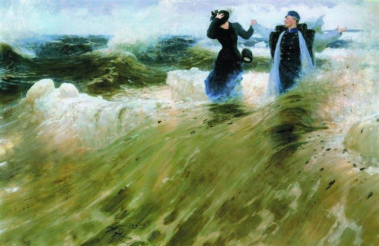

# Oerias (Sunday March 25th 2018) #

Most people complain when the clocks go forward because of the lost hour of sleep. As a chronic early riser I find the time change a blessing. Today thanks to the lost hour I wake at 6pm and only have a couple of hours to wait before the rest of the world starts rising.

I leave Kite at ten past eight as I'm heading back into Lisbon for a Sunday morning swim. The train ride is only ten minutes but there is a 20 to 30 minute walk either side. As I leave the marina and walk along the Oerias seafront I spy 4 people standing in a line at the edge of a rock facing in towards the shore. Each has either a book or a phone in their hand. It is a strange sight whose purpose does not become apparent until I draw closer. Then I see between the rock and the sea wall is a beach, no wider than 4 meters, that slopes gently down the side of the wall. On the beach, standing in the water, holding hands in a circle are three people dressed in white gowns. One of the three appears to be leading this strange ceremony, which I guess is some sort of baptism. 

As I walk away towards the train station, I marvel at the beauty of the ritual I have just witnessed. I am not a religious person but I do sometimes envy the certainty that religion seems to bring to some people. I reflect that right now I feel far from certain about anything. My mind seems totally confused, not least about what I shall write on my travels this year. It seems like I spent the winter wandering the world wide web. Consequently there are many ideas and thoughts floating around my head. I feel almost as if I am about to explode with all of the subjects that I want to discuss.

My first set of writings covered the voyage to Lisbon. Recently I have been collecting these together to publish in ebook form. I am not entirely un-pleased with the results. It seems that the escape from Brexit Britain that was the purpose of my journey acted to provide a central theme around which I discussed other more or less related topics. As of yet I have no such anchor for this years journey.

One might think of Oeiras as a suburb of Lisbon, similar in some ways to the London Borough of Barnet where I grew up. It is an area where cars are given preference to travellers on foot. As I take the pedestrian subway under the main road I recall similar tunnels at Apex Corner. Of course I reflect, I didn't grow up near a beach, or the sea, and only rarely experienced such warm sunshine in March. I exit the tunnel and walk up the hill to the train station at Santo Amaro. Once there I swipe my Viva Viagem card. After a few minutes waiting, I climb up into a carriage and stand for the short journey to Alges, staring out at the sea as the train trundles along the coast, back towards Lisbon.

At Alges, another place where cars seem to have the ascendancy, I dodge under a flyover and begin the long climb up the hill towards the Piscina Municipal at Restelo. The walk takes me through Belem, an area that houses many diplomatic missions. I pause to study a tiled mural, a commemoration of an attack by Armenian militants on the Turkish Embassy in 1983.  

On my last visit to the pool, earlier in the week, I had asked the reception how busy it would likely be on a Sunday morning. I had been told that there weren't usually many people before 1pm. The information was correct and now I find myself swimming all of my 40 lengths in a lane to myself. I marvel at the freedom this gives me. I need not worry about dodging others or stopping to let faster swimmers pass with ease. Instead I am alone with my strokes and my thoughts.

As I switch between front crawl, breast stroke and then back stroke, in the same regular patten that I have been swimming for years, I reflect on my freedom more generally. I feel incredibly lucky to have the freedom that I have in my life right now, and then it dawns on me, I may have my theme for this years voyage. Many of the ideas that have been whirling around can be tied back to the concept of freedom. The more I swim, the more connections I make, so that by the time I'm finished, I feel a warm creative glow.

As I make my way back to Kite, to prepare her for the voyage south the following day, I sense that whatever does happen as I sail will guide my writing this way and that, so that who knows what the overall output will be, but now with the notion of freedom as a theme, I suddenly feel much more certain about the journey that I am beginning.
  

[Creative Commons Attribution-NonCommercial-ShareAlike 4.0 International License](href="http://creativecommons.org/licenses/by-nc-sa/4.0/). 

