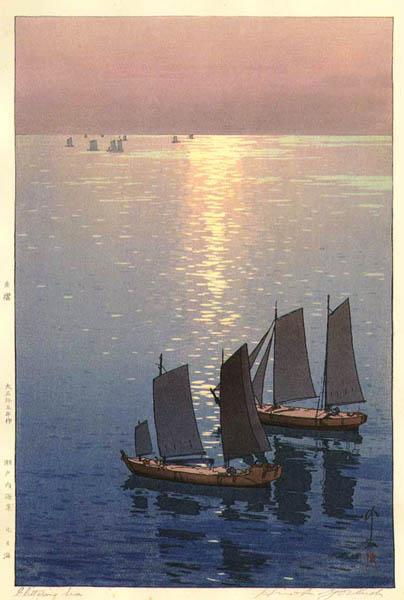

# Oerias to Sines (Monday 26th March 2018) #

I'm reclining in Kite's rear starboard corner, or [pushpit](https://en.wiktionary.org/wiki/pushpit) as it is technically known, steering with my foot. In front of me the sun climbs over the Portuguese coast, it's reflection creating a river of silver of which I seem to be the source. The rushing and faffing that comes with the start of a sail is done. I have had a cup of tea. The world is perfect. 

I'm just thinking about what possible image I can choose to describe the way I'm feeling when perfect gets more perfect. The phone rings, it's my daughter Maxime. I get to share my morning joy with her while she shops for her dinner after a long day at work in Sydney. We finish updating each other on our lives and the call ends. The silver river is still there and I go back to thinking of images.

As I write about my journeys I have got into the habit of choosing an image to go with each story. For me these add an extra dimension to the story, providing another channel as it were, through which I might try to convay the way that I'm feeling. Most of the images that I have used have come from the excellent [Wikiart](https://www.wikiart.org/) website, where I may search through thousands of artworks to find one that, for me, fits with my tale. With the sails set and Kite plowing her way through the sea on autopilot, I use my tablet to search the website, looking up frequently to ensure that we face no dangers.   

Though there are many images that I might use, I am constrained in the ones that I can pick. My freedom of expression is limited by the laws of copyright which  *"... intended to encourage the creation of art and culture by rewarding authors and artists with a set of exclusive rights" ([Wikipedia](https://en.wikipedia.org/wiki/Copyright_law_of_the_United_States))*. This I think is fair enough, for to me art and culture are important. So I select only from the [public domain](https://en.wikipedia.org/wiki/Public_domain) pieces to avoid legal hot water, or the lengthy process of getting permission from the copyright holder, and so I conform to the Wikiart site's rules which state:

> *"WikiArt.org allows unlimited copying, distributing and displaying of the images of public domain artworks. Artworks protected by copyright are supposed to be used only for contemplation. Images of that type of artworks are prohibited for copying, printing, or any kind of reproducing and communicating to public since these activities may be considered copyright infringement."*

At around 2pm the mainsail tries to gybe. This movement of the sail, from one side of the boat to the other, which is hectic in a dinghy, can be catastrophic in a yacht. In Cornwall last March, just South West of the Lizard, Kite performed an uncontrolled 'crash' gybe which ripped the boom from the mast, putting pay to any more sailing and forcing us, after emergency repairs at sea, to continue for over 24 hours on the motor. Luckily the boom just needed re-riveting onto the mast, a relatively cheap fix. Nevertheless, I have been wary of crash gybes ever since and use a line known as a gybe preventer to avoid such an accident ever happening again.   

Kite's attempted gybe indicates that, as expected, the wind has started to come round from a north easterly to a north westerly direction. I need to make a controlled gybe. This will involve winching the boom into the center of the boat, changing course slightly away from the wind, and then letting the boom out again on the other side. I start the process, but, as I look up at the sail, I can see a problem. One of the cars that hold the sail to the mast appears to be broken leaving a large gap between the sail and the mast. I guess it may have happend when Kite had attempted to gybe. I'm not happy to continue with the sail like this as other cars may end up being damaged. I turn Kite head to wind, get the mainsail down and resume on towards Sines on the motor. With this done and the autopilot set, I make some tea. As I sit in the cockpit my hands round my cup sipping gently, I remember another brush I have had with copyright law. 

It is 2009 and the journal [Interacting with Computers](https://academic.oup.com/iwc) are producing a special Festschrift edition in honour of my PhD Supervisor, [Professor John Long](https://en.wikipedia.org/wiki/John_Long_(computer_scientist)). I am very fond of John and am honoured when he asks me to submit a paper for publication. I haven't worked in the field of Human Computer Interaction for many years so, over a number of weeks, I wrack my brain as to what sort of paper I might submit. As an Investment Bank employee I muse that I almost know more about Economics now than the subject matter of my PhD. It is from this thought that inspiration finally comes. I decide to attempt to apply John Long's (and our former colleague John Dowell's) engineering design approach to design work in Economics. I do some background research and sketch out some ideas but soon realise that I will not have enough time to write the paper while working, so I decide to take two weeks holiday to complete the task.

The paper is submitted and, to my surprise excepted, but now is when the fun really starts. I'm informed by my manager at J.P. Morgan, where I work, that I will need to get permission from just below board of director level before the paper can be published in the journal. It takes considerable effort to achieve this and it is touch and go whether I will receive senior management blessing in time for the journals print deadlines. In the end my manager does me proud and I am emailed approval, conditional on talking to the firms legal department. In the call with the legal team I learn that my firm has two stipulations. Firstly the paper must contain a statement that:

> *"The author is not necessarily representing the views or opinions of JPMorgan Chase & Co."*

Secondly I must include a note that says:

> *"JPMorgan Chase & Co. All rights reserved."*

In other words my employer is claiming ownership of a piece of work that has little or nothing to do with my day job and that I have created in my vacation time. I query this with the firms lawyer on the other end of the phone. He informs me that he can't possible advise on my intellectual property rights as he is acting for the firm but suggests that I consult my own intellectual property lawyer. How much will that cost I ask? Probably around $500 an hour is the reply. Unable to afford the likely legal fees, with the print deadline for the journal fast approaching, I'm unwilling even to start this fight, so JPMorgan Chase & Co gets the copyright. 

I was brought up in a socialist household and can't say I'm a natural fan of banking corporations, but I was proud of my employer. They were one of the few banks not to be severely hit by the 2008 financial crisis, even rescuing Bear Sterns and Washington Mutual. They had let me work part-time to co-parent my children and look after my father in his last years. Diversity and inclusion were important to the firm as evidenced by frequent training and positive attitude to, for example, the firms LBTG employees. Being hustled over intellectual property in this way left a nasty taste in my mouth, but far worse than this was learning that as an employee I had to seek permission from my employer in order to publish. My very freedom of expression was subject to veto by JP Morgan.

I look up and realise that we are approaching Cabo de Sines. Any more thoughts about freedom of expression and intellectual property will have to wait for another day as the surrounding sea is becoming much more hectic with traffic. I need to pass the Cabo (Cape) then turn eastwards into the main bay and then north east into an inner bay that houses the marina. There seem to be boats everywhere. I notice most of the large cargo vessels are anchored, but one is moving heading towards where I want to be. Meanwhile in front of me are another two smaller vessels. I am concerned for a minute that I am going to be right in the middle of something. Then I realise that the smaller vessels are tugs going out to aid the slowing tanker. I nip behind them and, out of the way of the larger shipping, put out my fenders and lines as I head into the inner bay. I turn to starboard and radio the marina. I get no answer but spot a row of empty berths and guide Kite in this direction. I moor Kite satisfactorily and I'm soon welcomed by a member of the marina staff.

[Creative Commons Attribution-NonCommercial-ShareAlike 4.0 International License](href="http://creativecommons.org/licenses/by-nc-sa/4.0/). 
