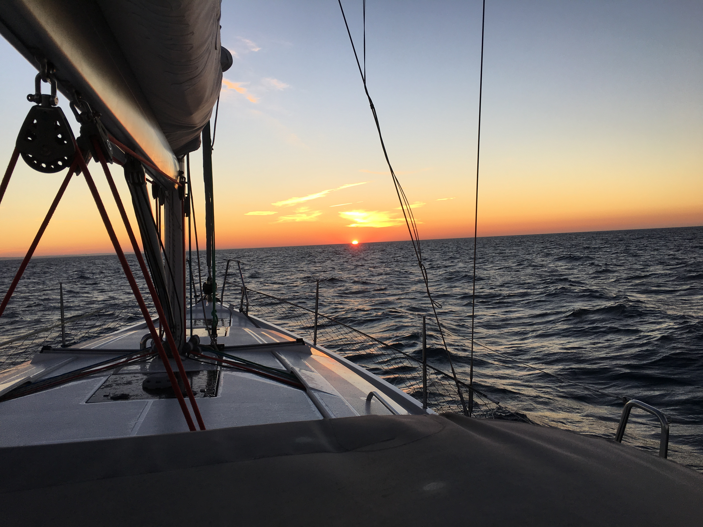

# Sines to Lagos (Tuesday March 27th to Wednesday March 28th 2018) #

At 7am I walk up the ramp from the pontoon and through the security gate. I head towards the marina building. Due to an systems problem the office was unable to issue me with a security pass the night before, but I was assured that there would always be someone at the end of the intercom. Unfortunately these assurances prove to be false and there is no entry to the toilets. I head back towards Kite but now I have another problem. The pontoon security gate is separating me from my boat. I try the intercom again to no avail. I have a quick look at the security gate. It is tall with good protection either side. I take a few paces back and see that the ramp down to the marina is the weak point. I climb down onto the rocks then with ease pull myself up onto the ramp and return to my boat.

Back on Kite I gather my swimming stuff together and head off into Sines to find the municipal swimming pool. My walk through the town passes mostly modern buildings. Few people are about. The pool is also fairly empty and once again I get a lane to myself. While I put in my lengths I can't help but reflect on my security gate experience from earlier. Barriers so often look impossible to pass, but how many times are their restrictions on our freedom illusory?

On the way back from the pool I visit the supermarket to replenish supplies. Since I moored in Sines the previous evening I have been thinking about how to replace the broken main sail car. These cars have a flange that holds them into the mast and a wheel on each corner that help them run up and down the mast easily. The broken car has separated from it's flange which is still inside the groove on the mast. This is not a problem as I have a number of spare cars. My problem is how to attach the car to the main sail. The existing cars are fixed by loops of fabric tape that are then sewn into the sail. Though I can mend stuff at a pinch I don't count needlework as one of my skills, so I need a temporary fix, that will work until I can get the sail to a sail loft. I settle on using a number of cable ties covered by gaffer tape to make sure any sharp edges don't damage the sail. The fix takes less time than I thought. Happy I head down into the main cabin to make some lunch and then take an afternoon nap.

At seven pm, an hour before sunset, I slip my lines. As we leave the bay I get my fenders in and then turn Kite north east, slow the engine and raise the main. I haven't gone far when I look up to see that the new car has separated itself from the sail, an indication that maybe you can't fix all things with cable ties and gaffer tape. The sail is pretty useless so I decide to pack it away and continue on the engine. This is most of the sailing work with none of the sailing fun. As Kite moves gently, if somewhat noisily, through the waves, under the moonlit sky, I resist the temptation to curse my luck. I am enormously lucky to be here at all. With no sails up there is not much to do, so it is not long before I start thinking again. The freedom I think of now concerns movement.

Normally the term *Freedom of Movement* is associated with the [European Single Market](https://en.wikipedia.org/wiki/European_Single_Market). It is one of four freedoms that make up the market, the other three being; goods, capital and services. It, together with the role the EU has had in bringing peace to Europe, was a principal reason for me voting remain in the UKs 2016 referendum. When the dust settles on the Brexit negotiations, it will most likely be the the issue which determines whether I remain in the UK or become resident in another European country. It is a topic I will undoubtedly return to in these stories, probably more than once. However with the moon rising and Kite's diesel engine chugging along, it is not where my mind wanders.

Instead I think of our right of free movement across the planet. A hundred and fifty years ago there was little or no control of this freedom. The first immigration law in the United States was the [1882 Chinese Exclusion Act](https://en.wikipedia.org/wiki/Chinese_Exclusion_Act). The United Kingdom didn't impose immigration restrictions until the [1905 Aliens Act](https://en.wikipedia.org/wiki/History_of_UK_immigration_control#1905_Aliens_Act_and_the_Immigration_Boards). I would like to live in a world where human beings can rove across the planet as freely as wild birds. Yet before we might achieve this freedom to move in space, there are problems that need to be solved. How, for example, do we stop everyone ending up on the same spot? What role does nation and residency have in establishing our identities? It seems that here too, there is much to think and write. My mind, however, continues to wander. 

Freedom of movement in space is all very well, but without the time to take advantage, it is all but useless. Time, it seems to me, tired in the dead of night, as Kite motors south along the Portuguese coast, is where most people have little or no freedom, caged by employment for much of their lives and let out for insignificant chunks to create the illusion of freedom. Some like me are lucky enough to escape the bonds of employment and live freely for a while before the infirmities of old age once again act to constrain, but this is not the fate of many. The most important freedom of movement, it seems to me, is the freedom to move in time. I feel myself dozing off and I and make coffee to stay awake. My thinking may be done for the night.

It is 4.15 am. The moon is to the west. I see the red lights of the wind farms on the coast and, just to the south, a single white light blinking, the light house at Cabo de São Vincent, the South East Corner of Portugal. Slowly the moon takes on a more golden hue and then sets into the clouds. The stars get brighter and the Cabo Vicente light clearer. With the lighthouse due East, I point Kite to the South and East.

At 6:30 am just south of Sagres I get the first hint of dawn, I set Kite on a north easterly course. At around 7:30am the suns red orb appears over the horizon. Dawn at sea is often a magical time for me and today does not disappoint. As the day gets warmer, layers are shed and I feel myself open up like a flower.

As we approach Lagos, while getting the fenders and lines ready, I notice the beautiful rock formations and coves. Though I have plenty of time, I decide to get my pre arrival tasks done early in case I make a mistake as a result of my tiredness after the long night voyage. The starboard side fenders which I hope will be next to a boat I tie high. The port side fenders, which will be next to a pontoon, I tie low, but to stop them dragging in the water, I keep them on deck.

I spot the marks at the harbour entrance and slot Kite in between some fishing boats returning with their catch. They turn off to the fishing harbour on my port side while I continue on to the marina's reception pontoon. There is not much space to moor. I come in slowly and get and aft line on, and motor forward, proud of my skills, until I notice that I haven't put the port side fenders down. The crunch is more gentle than I feared and I soon have the fenders in place. There is a slight scratch to the gelcoat but hopefully it will polish out.

[Creative Commons Attribution-NonCommercial-ShareAlike 4.0 International License](href="http://creativecommons.org/licenses/by-nc-sa/4.0/).
