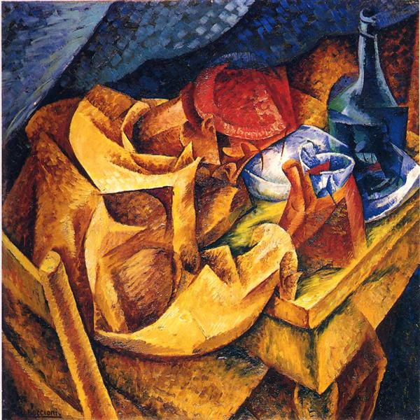

# Lagos (Wednesday 28th to Friday 31st March 2018) #

Most of the rest of my Wednesday is spent catching up on sleep after my night at sea, but I do reflect on my sail problem and decide that, since I have a spare, I will change the mainsail. This is a big job and difficult to do by oneself, so I am up early on Thursday morning developing [secret plans and clever tricks](http://www.roalddahl.com/roald-dahl/characters/beasts/the-enormous-crocodile) to swap my sails over.

The first job is to remove the fibreglass battens that give the sail stiffness. The battens for the two mainsails that I own are of different sizes, so there is permanently a set cable tied to Kite's guard rail. It takes about an hour or so to get to a state where I have the new battens free and the old battens out of the sail and cable tied to the rail. I am now ready to take the sail down.

Kite has about 40 square meters of mainsail which I have to get off the mast, folded and rolled into a sail bag. There is already some wind and it is forecast to increase later. Imagine folding a bed sheet that is 3 double beds wide and three double beds long and you'll get some idea of my problem. I devise a systems involving ropes that lets me lower the sail onto the pontoon next to the boat, and then with a mixture of lowering and folding get the sail ready for the bag. It is going well but slowly when Harry pops by and lends a hand. My helper, I learn, lives in the UK but has kept a sailboat in Lagos for the past 18 years. With his help we have the old sail folded in no time. Another sailor's kindness has saved me an hour or two.

The sail is still a bit damp at the top so, tied to the pontoon I leave it to dry for a bit. I head inside to clean the boat and make up beds for my crew that are due to arrive latter. I go to connect my phone to Kite's sound system but as I do I realize than I'm not really up for music. As I fiddle with Spotify on my phone I discover Stephen West's [Philosophize This](http://philosophizethis.org/) podcasts. Throughout the day I listen to his series on Nietzsche.  

Once the inside of the boat is sorted, I head back outside to find the removed sail is dry. I roll it and get it into the sail bag. I unroll the replacement sail and, in a process that is almost the reverse of the removal, I get the new mainsail attached to the mast. I should really add the new battens, but as this is a job that is far easier with a second pair of hands I decide to wait until my crew arrives. 
 
I potter around Kite completing boat tasks and listening to philosophy until 6pm when its time to go and meet the crew from the train station, a mere five minutes walk from the marina. As I approach the station my phone buzzes with a text telling me that they have caught the bus instead and that they are still half an hour away. I consider returning to the boat but decide instead that I'll head to the bus station and sit in a cafe until they arrive. Over the course of an hour I nurse one, then another sparkling water until it becomes clear that the owner of the cafe is about to close up. I walk out to the bus station and find a patch of wall where the setting sun is still bestowing it's warmth and lean back to rest my bones. No sooner have I done so, than a bus pulls up.

I see Raff first. He almost doesn't recognise me until I remove my baseball cap and shades. Then he hugs me and introduces Riff, who's hand I shake. Raff I have known for about five years, ever since he turned up to a party at mine, 12 hours late, after missing his stop on a flight. This wasn't a problem. The party lasted two weeks and had barely started at that point. Riff is Raff's friend and we have only just met.

Of course, Riff and Raff are not their real names, but rather epithets that I have chosen after consultation. Raff I think suits, due to his raffish good looks. I remember him, at the aforementioned party, sitting on my sofa, a woman on each side, both staring up into his eyes while curling his dreads in their fingers. His companion's name suits too, as he will over the coming days illustrate his ability to riff on most subjects, keeping the conversation going down new and interesting byways. Of course their names admit a description of the pair of them as "the Riffraff". I'm concerned, as this name might enforce a stereotype of two long and mostly dreaded haired, 30 year old males, whose main concern is where their next spliff is coming from. They are so much more than this. They appropriate their new names including the collective Riffraff. So for this account, Riff and Raff is what they shall be called.

I sense the concept of equilibrium is going to become important in my stories this year. [Wictionary]() defines equilibrium as:

> *"The condition of a system in which competing influences are balanced, resulting in no net change."*

I have at least two equilibria. One is the contemplative sober me that does not drink or smoke, leads a gentle existence, with regular exercise who sleeps and and rises early. The other equilibrium is the party animal, who drinks, smokes and dances to all hours. In either state I seem perfectly balanced. At any moment, one might almost picture these my state as a ball in a landscape, and my equilibria as dips in that landscape:    

We head back to the boat to drop off the Riffraff's bags and then return across the harbour bridge for a beer and some food. As we climb up away from the water I feel my equilibria shifting as if my ball is being rolled up the hill by the force of the Riffraff. In the first bar I have already had a beer and a cigarette.

................. 

It is 6am and the music finishes. Monica and I stop dancing and head back to the bar. I have a beer on the counter but I really don't need anymore to drink. Monica grabs her red leather jacket and I wake Raff from where he is sleeping on the dance floor. We lost Riff hours ago. Outside Raff and I kiss Monica goodbye and thank her for showing us Lagos nightlife. We turn and head downhill towards the water while rolling cigarettes. Back at the boat, the sun is nearly up. Riff is asleep in the main cabin. Raff and I climb into our respective berths and soon join him in notching up the zeds.

At some point I wake to a hangover and head out to use the marina's facilities. As I walk along the quay, I can't help but reflect upon Stephen West's interpretation of [Nietzsche](https://en.wikipedia.org/wiki/Friedrich_Nietzsche) from the podcasts the day before. According to Stephen, Nietzsche considers a question that nearly everybody asks at some point:

> *"What is the meaning of my life?"*

Given Nietzsche believes, that for any individual, there is no ready answer to this question, that life is, in essence meaningless, he asks a further question:

>*"Should't you expect to see the vast majority of people with a nihilistic outlook on the universe?"*

In Stephen West's interpretation, Nietzsche believes the reason that most people aren't [nihilistic](https://en.wikipedia.org/wiki/Nihilism), the reason that they don't just collapse from despair at the meaningless of it all, is that there is usually an alternative to nihilism in the form of a True World Theory. Lots of these true word theories abound in human belief systems:

* **[Abrahamic Religions](https://en.wikipedia.org/wiki/Abrahamic_religions) (Judaism, Cristianity, Islam etc)** have as true world [Heaven](https://en.wikipedia.org/wiki/Heaven)
* **[Plato](https://en.wikipedia.org/wiki/Plato)** has as true world the [World of Forms](https://en.wikipedia.org/wiki/Theory_of_forms) 
* **[Marxism](https://en.wikipedia.org/wiki/Marxism)** has as the true world [Communist Society](https://en.wikipedia.org/wiki/Communist_society)

Many belief systems seem to justify the meaningless pain of the present with the promise of a better true world.

Stephen goes on to talk about Nietzsche's view on alcohol. To cut a long story short Nietzsche's not a fan, he [talks of](https://www.goodreads.com/quotes/57920-two-great-european-narcotics-alcohol-and-christianity):

> *"Two great European narcotics, alcohol and Christianity."*

He sees alcohol, and presumably all narcotics as just another true world. How many people get through the day with the thought of that pint waiting for them in the pub when they finish or that glass of wine waiting for them when they get home in the evening? For a few hours, you can enjoy life as the true world of alcohol instantly solves all of your problems, before you wake the next day to begin the pain all over again.

I get back to the boat and, as I curl up under my covers, through my headache and nausea, all I can feel is nihilism. There is no true world that's going to cut through this hangover, not even, I suspect, a [hair of the dog](https://en.wikipedia.org/wiki/Hair_of_the_dog).

[Creative Commons Attribution-NonCommercial-ShareAlike 4.0 International License](href="http://creativecommons.org/licenses/by-nc-sa/4.0/).
