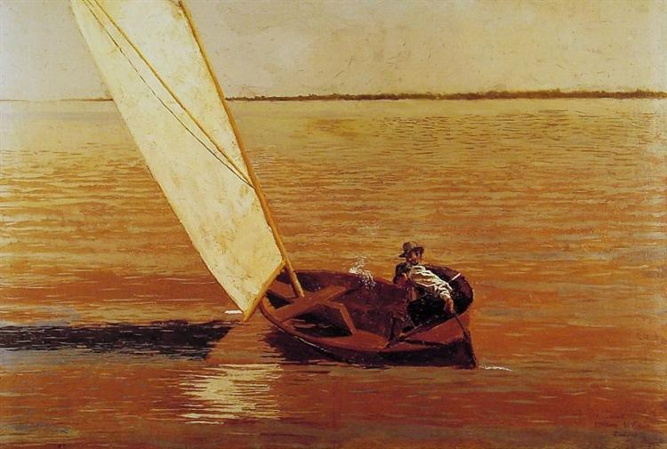

# Lagos to Vilamoura (Saturday 31st March 2018) #

It's Saturday. We rise early as we have a sail ahead of us. Since we spent most of Friday hungover, there is loads of work to do. The main task is to put the battens into the replacement mainsail. We get about this task quickly and are almost done except I can't find the alum key for the bolt that secures the last and biggest batten. We search high and low for the key but of it there is no sign. We add a visit to the chandlers to the todo list and head to the marina office.

Once there I need to pay for an extra day and, as they have joined as crew, the Riffraff need to show their passports. This done we head into the supermarket to buy some pizzas for our sail, then head round the back of the fishing harbour to the chandlers where I pick up a new and expensive set of alum keys. We get back to the boat and get the batten secured. We rush round stowing items and getting things ready. I take off the instrument covers and lift the removable center of the cockpit table, so that I can stash them for the journey and there, of course, is the missing alum key. Never mind, I think, it is always good to have spares.

I switch on the radio and tune to the marina's working chanel. To enter and leave Lagos marina, sailboats require the bridge across the harbour to be lifted. I hear another boat make a request to have the bridge opened. I hurry the crew along and explain how we are going to leave our berth. I radio the marina and am told to join the back of the queue of boats. 
 
Once past the bridge, Riff helms, steering us out to sea, I take off the front fenders but I let Raff remove the rest. With these and the lines stowed we are ready to raise the mainsail. Riff holds the boat head to wind while I pull on the main halyard at the mast while Raff pulls it in using the winch in the cockpit. We have the mainsail up in no time.

Once out at sea the wind is coming from the South. As we are more or less heading East, the wind is coming over our starboard side, on a point of sail know as a beam reach. We waste no time in getting the jib out and are soon flying along. Riff's father keeps a sailboat in Turkey and he has raced dinghies so he is a competent sailor. He seems happy to fiddle with the sail set up to try and squeeze out that extra bit of performance. Raff's only experience of a sailboat is as crew on a voyage form the Azores back to Falmouth. However he works as a rigger at festivals and for theatres and learns fast.

As lunchtime approaches I put the oven on, and, when it's warm slide in the first pizza. Once its crispy I use kitchen scissors to cut it into slices which I take up to the crew. After two pizzas, we have filled a hole but I make a note that we might need three for our next voyage.

We make steady progress passing the Algarve towns of Portimao and Albuferia, both of which I know from sail training last year. Finally we get close to Vilamoura and with copious referrals to the pilot guide, spot the marina entrance. Once we get close we turn the boat into the wind drop the mainsail. Riff helms and Raff lets the halyard down slowly while I flake the sail neatly. I think to myself that I could get use to this having a crew lark. 

As we enter the harbour we spot the reception pontoon to our port side. Once again there is not much room, this time due to a large motor cruiser. I make an attempt to come in from the south but feel that the tide is too strong and pull out after kissing the pontoon with a fender. I take my time and decide to come from the north. I choose a spot on the fuel pontoon that has plenty of space and will enables us to fill up on diesel. Coming from the north into the oncoming tide gives us much more control over our speed and steering and we moor successfully.

[Creative Commons Attribution-NonCommercial-ShareAlike 4.0 International License](href="http://creativecommons.org/licenses/by-nc-sa/4.0/).
