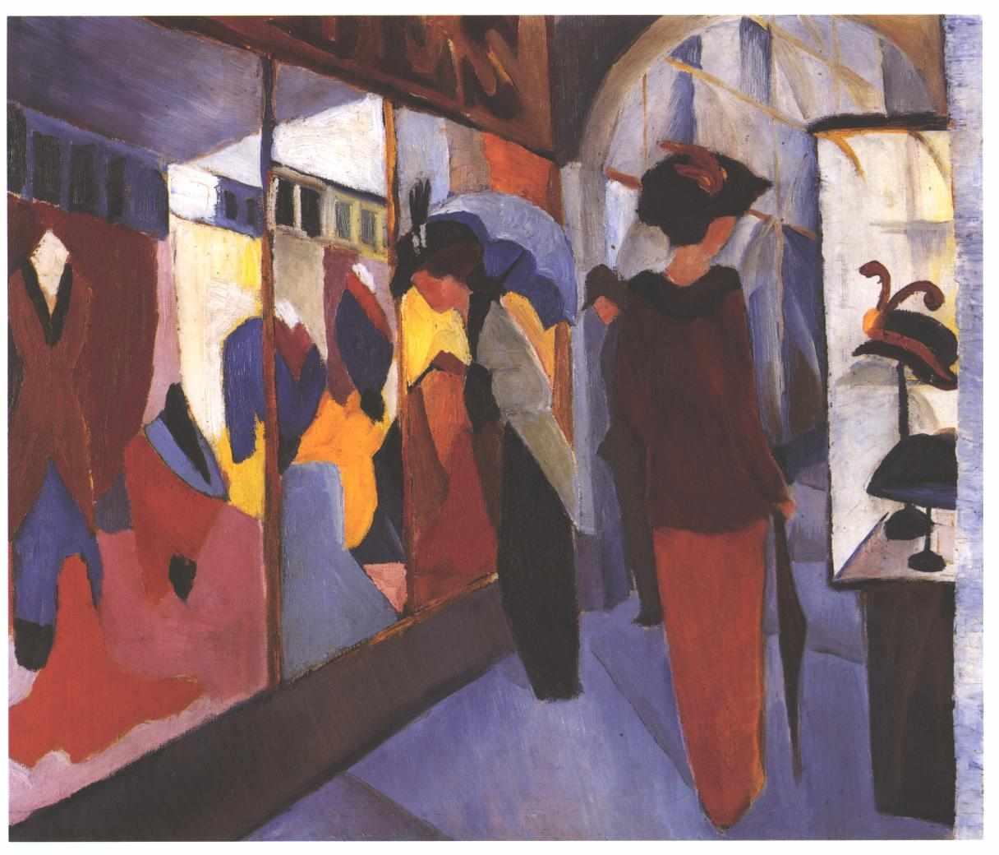

# Vilamoura (Saturday 31st March to Monday 2nd April 2017 )#

If you were to transport London's [Westfield Stratford City](https://en.wikipedia.org/wiki/Westfield_Stratford_City) shopping center, including the people, to the South Coast of Portugal, open it up and add more than a sprinkling of Irish bars, and then, plonk a marina in the middle, you would have a pretty close approximation to the harbour at Vilamoura. I suppose if you are the kind of person that never wants to be more than 25 meters away from an English Breakfast then this is a place for you. The Riffraff and I do not feel so at home. 

We search the town for somewhere to eat. We first walk, the not insignificant distance around the marina, looking at the establishments facing the water and those in the back streets but find nothing that takes our fancy, either in terms of the food on offer or the price. It is only when we double back and head up one of the streets by the boat that we find Petunia, a cafe that offers Portuguese cuisine at a reasonable price. As we sit down I notice that all of the clientele, excepting us, are Portuguese, many engrossed in the football match between Sporting and Braga on the surrounding television screens. We eat well here and will return regularly to this place over the next 24 hours, as we find nowhere else near the boat that even comes close.

After dinner, at the behest of the Riffraff, we head to an Irish bar to catch the [Joshua - Parker fight](https://en.wikipedia.org/wiki/Anthony_Joshua_vs._Joseph_Parker). If my mother had been given the chance she would have banned boxing, though even she had a soft spot for Muhammad Ali. I'm not a big fan of pugilism myself, but unlike my mother, I would defend others right to fight in this way, assuming that they were fully aware of the risks. From what little knowledge I have, Joshua seems to be the boxer while Parker is more a brawler. Joshua's height, reach and skill seem to give him the advantage and he convincingly wins the bout. By the time the fight is over I have drunk enough beer and head back to the boat. The Riffraff meanwhile heads off looking for more adventures, eventually blagging their way into a Casino.

The next morning I awake, trapped in my cabin, not just by the still fast asleep crew but also by the mainsail that I removed in Lagos and stowed in Kites, otherwise quite expansive, forward berth. Eventually I can stand it no longer and I grab my things and head out. I'm hungry but also need to search for a laundrette as I'm running out of clean clothes. Once I have left the boat I look at my phone and find that there is a laundrette about a kilometer away, in the neighbouring town of Quarteira. My route takes me past Petunia, where I stop for a brunch of decaf coffee and a cheese and ham omelet.

I walk the kilometer along the coast and then check out the laundrette, which is fine, except that there is no option to add your own detergent. For variety I decide to head back a different way, cutting in land. This proves more difficult than I had imagined, as routes that look passable on google maps are blocked off by gates or fences. I begin to suspect that this might be deliberate plan to keep Quartiera and Vilamoura Harbour seperate. 

I stop at the marina facilities before returning to the boat and there I encounter the Riffraff. They regale me with their previous nights adventures as we head back to the boat. I bore them with some details of the [philosophy podcasts](http://philosophizethis.org/) that have accompanied my walks; [a dispute](https://www.theguardian.com/books/2012/jun/24/boxer-goalkeeper-sartre-camus-martin-review) between [Albert Camus](https://en.wikipedia.org/wiki/Albert_Camus) and [Jean-Paul Sartre](https://en.wikipedia.org/wiki/Jean-Paul_Sartre). Before being educated by my podcasts, all I known about Albert "the cat" Camus is that he was a writer who played in goal, that he had [once said](https://www.goodreads.com/quotes/87249-everything-i-know-about-morality-and-the-obligations-of-men):

>  *"Everything I know about morality and the obligations of men, I owe it to football"* 

I gather up my washing and head back to the laundrette along the coastal path, this time with tales of [Heidegger](https://en.wikipedia.org/wiki/Martin_Heidegger) in my ear. 

Nietzsche became associated with German National Socialism, though scholars have largely put this down to the reworking of his manuscripts by his sister [Elizabeth](https://en.wikipedia.org/wiki/Elisabeth_F%C3%B6rster-Nietzsche). There is no such ambiguity surrounding Heidegger who was a card carrying member of the Nazi Party. In my head I question as to whether this is a reason to discount his philosophy.

I learn from Stephen West's podcasts that Heidegger turns philosophy on its head by focusing on [Ontology](https://en.wikipedia.org/wiki/Ontology) - the study of the nature of being. I don't really get how Heidegger is so different from other philosophers but I decide to continue listening. According to Stephen, Heidegger aims to define what it is in essence to be a human being. He is trying to craft a definition that applies to humans regardless of the time or culture in which they exist. To do this he coined the term [Dasein](https://en.wikipedia.org/wiki/Dasein) (literally being there or presence). A Dasein is a being: 

* that takes its own being as an issue.
* is constantly engaged in tasks or activities that they care about.

As I listen, I'm a bit non-plussed and don't understand what is meant by "care". The podcast is well ahead of me, and Stephen goes on to describe the three components that determine the things that a Dasein cares about:

* ** [Facticity](https://en.wikipedia.org/wiki/Facticity) ** is the set of circumstances that we are born into, including our physical attributes and our culture. As I bend down to shovel my clothes into the washing machine I realise that this scene is very much part of my Facticity. What I am doing would be incomprehensible to a pre historic human being, as much as hunting with stone weapons would be to me.

* ** [Fallenness](https://plato.stanford.edu/entries/heidegger/#Car) ** is the set of behaviours that we have fallen into without thinking and is largely determined by those around us. I think back on Vilamoura Harbour, a kilometer away, and wonder how many of the English tourists that wander around the marina have fallen into the modes of behaviour that they exhibit just because that is what the people around them do.

* ** [Existentiality](https://en.wikipedia.org/wiki/Existentiell) ** can be described as the possibilities that each Darsein has at their disposal. One possibility might be, for example, to escape the falleness of a vacation spent in the Irish Bars and chain shops of Villamoura harbour and break out to discover the different Portugal that lies beyond.

According to Stephen West, Heidegger believes that the life of a Dasein is lived on a continum of authenticity. At the in-authentic end of the spectrum, one's facticity and falleness govern what one does. You might be considered as being in-authentic if, for example, you wander endlessly around Vilamoura without questioning what other possibilities might exist. At the authentic end of the spectrum you fully engage with your existentiality, reflecting on your facticity and falleness while understanding the other possibilities that lie before you. I think back to my problem with the locked security gate at Sines marina and how I overcame the facticity and falleness of my situation by climbing down to the rocks to get past the apparent barrier. 

Living Heidegger's authentic life is all very well I think, but if I made a habit of bypassing all the security gates I face in life, my behaviour would be more than frowned upon. Here in essence lies a problem in living an authentic life - potential isolation. Stephen West claims that Heidegger's answer to this is to take your authenticity and use it to re-engage with the culture around you. For Heidegger, this culture was 1930's Germany, hence, Stephen hints, his membership of the Nazi Party.

With my washing done I head back. On the boat, the Riffraff and I decide to avoid any kind of Heideggian re-engagement with Vilamoura Harbour. Instead before dawn the next day we will sail Eastward in search of something perhaps, if you pardon the pun, more authentic.  

[Creative Commons Attribution-NonCommercial-ShareAlike 4.0 International License](href="http://creativecommons.org/licenses/by-nc-sa/4.0/).
