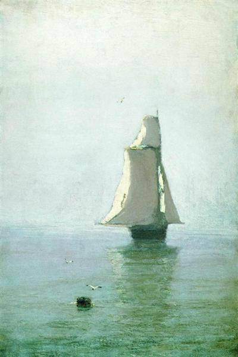

# Vilamoura to Vila Real de Santo Antonio (Monday 2nd April 2018) #

My alarm is set for 5am but I spend a restless night and am fully awake at 4:30. While still in my cabin I get the latest weather reports and recheck the tides writing all this information in my temporary log book. 

The [International Regulations for Preventing Collisions at Sea (or COLREGS as it is also known)](https://en.wikipedia.org/wiki/International_Regulations_for_Preventing_Collisions_at_Sea) mandates the keeping of a ships log. Somehow I have managed to mislay the logbook that I used in 2017. So now I keep three copies of the log. The first is written into a simple notebook. This is a temporary record and used anywhere inside the boat and outside in the cockpit, from where I suspect my original book may have been lost overboard. The second is stored on spreadsheets in the cloud, this includes the log of 2017, much of which I have managed to recreate from other documentation including my blogs. The third log is hand written in a book that lives in the chart table and is only taken out in port to write up the formal log or to show to officialdom. 

I leave my cabin at 5, our agreed waking hour, and head to the marina facilities. When I get back I put the kettle on and start preparing the boat for sea. With coffee made I wake the Riffraff. They are soon up and dressed. When they have made it back from the toilets, we call the marina on the radio. The marinherio soon arrives on a rib. We exchange our security passes and electricity cable for the 30 euros deposit, say our thank yous and sail away from Vilamoura into the night. It is 6.30 am. 

We have the fenders in and sails raised in no time. Keen to capture the sunrise and our days adventures on his Go Pro, Riff sets about rigging up a makeshift tripod by cable tying the ships broom to the back of the boat. With this done there is nothing much to do except keep an eye on the sails. With the sun masking the clouds there isn't much of a sunrise.

There is not much wind and our progress is slow. To try and speed things up I dig out Kite's [Cruising Chute](https://en.wikipedia.org/wiki/Spinnaker#Cruising_chute). This is a large foresail that is often difficult to handle, especially when the wind gets up. Somewhat confusingly, given my boats name, sails of this sort are often referred to as the kite. 

When not being used, Kite's kite (see what I mean), lives snuffled inside a bag in the rear aft locker. The term snuffled refers to the fact that the kite is kept in a giant sock, called a snuffler. To use the sail we clip the spinnaker halyard onto the head (or top corner), attach the tack (or front corner) of the sail to the front of the boat on a short line and then run a longer line called, somewhat confusingly, a sheet, from the clew (or back corner) of the sail to the cockpit. We then use the halyard to raise the sail still inside its snuffler. When all this is done we use the snuffler's control ropes to pull the snuffler up to the top of the mast and release the sail. Putting the kite away is just the reverse process of getting it out, in theory at least.

In the year that I have owned Kite I have used the Cruising Chute exactly twice. The first time I was sailing with my daughter Max and one of her friends and learned exactly how difficult it is to get the kite back into its snuffler when the wind picks up. The forces involved were so great that I came close to being pitched overboard and the whole experience terrified the crew. My second attempt was when sailing solo and was more of a success except the winds were so light as to make the sail more or less useless. 

With Riff, an experienced sailor on the crew, and wind speed dropping it seems like a reasonable time to try the kite once again. After a quick briefing we deploy the sail and increase our speed successfully. We manage to keep the speed up for about an hour until the wind drops further and we have no option but to pack away the kite and continue on the motor. 

After a simple lunch of soup and biscuits, the wind gets stronger and we deploy the kite again. Wary of my first experience I suggest that we plan to bring he kite in if our wind speed hits 10 knots. We can tell the wind speed and direction thanks to a device that sits atop the mast and and send signals of wind speed and direction into Kite's electronic network. These signals are then captured by instruments into the cockpit and displayed to the human crew.

While Raff sleeps in his cabin, Riff takes on his usual role of monitoring the sails while keeping a careful eye on the wind. I sit back and marvel how all this is possible thanks to the [Age of Enlightenment](https://en.wikipedia.org/wiki/Age_of_Enlightenment). I reflect in particular on one philosopher credited with influencing the Enlightenment; [Rene Decartes](https://en.wikipedia.org/wiki/Ren%C3%A9_Descartes).

Decartes found a starting point for his philosophy by doubting perception until he came up with a single principal, his famous:

* **"Cogito ergo sum" - "I think therfore I am" **

From this idea, that he is a thinking thing, he builds an entire philosophy based around deduction rather that perception. It is from Decartes that we get the [Subject-Object distinction](https://en.wikipedia.org/wiki/Subject_(philosophy)) that makes sailing a modern boat like Kite possible. We sailors are the subjects, the unique consciousnesses, who interact with our objects, the boat and the environment. The objects have attributes. For Kite these attributes are things like:

 * Boat Speed - indicated by a tiny paddle wheel under the boat
 * Speed Over Ground - indicated by GPS data
 * Direction - indicated by the compass
 * Sail trim - how tightly the sails are pulled into the boat
    
 For the Environment attributes include:
 
 * Wind speed
 * Wind direction
 * Wave height
 * Atmospheric pressure  
    
I look over at Riff, as in response to a slight change in wind direction, he adjusts our sail trim by letting out the Cruising Chute sheet to improve our boat speed. He shouts over to me that wind speed is up to 9 knots. Managing the object that is Kite in the object that is the Environment to achieve the goal of getting to our destination is, in many ways, what sailing is all about. However if you ask me if that's why I sail, I would say yes, but that's not the whole story.

Bored of my reflections I lean back into Kite's starboard aft railing and let all thoughts leave my mind. I stare out to sea and am one with world, my situation is what an artist friend of mine talks of as the [sublime](https://en.wikipedia.org/wiki/Sublime_(philosophy)#Post-Romantic_and_20th_century). This is the other reason that I sail, that feeling of just being there in the world. Suddenly I feel jolted out of this state and back into the world of subjects and objects. Of course that's what the philosopher Heidegger means by Dasein - being there. I remember Stephen West in his [podcast](http://philosophizethis.org/) talking about how Heidegger rejects Decartes *cogito ergo sum*. Dasein is talking about that space before the "I", that space where you are at one with the world. This is how Heidegger turns philosophy on its head. 

I smile at the understanding that I've gained. If I had been single handing I would have probably laughed out loud, but I restrain myself lest Riff thinks his skipper on the verge of madness. I call over to him asking for our wind speed. Touching 10 knots he replies. The  We look at the sail and the boat and figure we can probable raise our wind speed limit. I decide on 13 knots. It's a number that has fond memories for me.

I look at my watch, the hour is up since I wrote my last log entry. It is time to note down, in the temporary log, the important attributes of the objects, that as sailors, we are managing; our position, the distance we have come through the water, the atmospheric pressure, the wind speed and wind direction. This task is somewhat dull and made doubly dull by my keeping three copies of the log. I wish Kite's clever systems could do this task for me, but that, is a whole other story.

When I finish my tasks in the world of sailing objects I sit back again and reflect on another aspect from the podcasts on Heidegger. In Stephen West's interpretation, Heidegger believes that human beings are too engaged in the world of subjects and objects and neglecting just being there. This treating our environment as an object, as a resource to be exploited, rather that existing with in it, is alienating us as human beings. All of a sudden this sounds very familiar. I have encoutered this before in one of my favorite books, [Zen and the Art of Motorcycle Maintenance](https://en.wikipedia.org/wiki/Zen_and_the_Art_of_Motorcycle_Maintenance). This work by [Robert Pirsig](https://en.wikipedia.org/wiki/Robert_M._Pirsig) has had a profound influence on me. I look at the style of my blogs, a sailor on a journey who drifts off into reveries about other topics and can't help but find it derivative of Pirsig's journey on a motorcycle. Later I will search his book but find no mention of Heidegger, strange.

The wind speed gently rises. Raff returns to the cockpit after his slumbers. Eventually the instruments show that the wind is approaching 13 knots and I head forward to pull down the snuffler. It is a struggle, but with careful release of the sheet by Riff I manage it. Raff gently lets down the halyard and kite is soon packed away for another day. We, all three, high five each other, pleased with our success. We continue making good time with just the main sail. On arriving at the bouys that mark the safe passage into the river Guadiana, we carry out our usual end of sail chores and head upriver to the marina. Portugal is to our left and Spain to our right. We arrive at the marina expecting to find the slack water around high tide only to experience a strong upstream current, but with help from a new neighbour we are soon moored.  

[Creative Commons Attribution-NonCommercial-ShareAlike 4.0 International License](href="http://creativecommons.org/licenses/by-nc-sa/4.0/).
