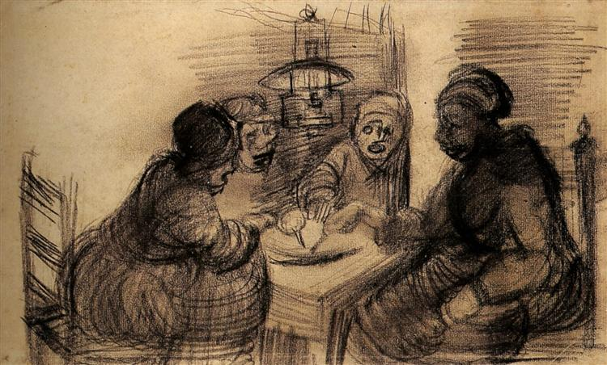
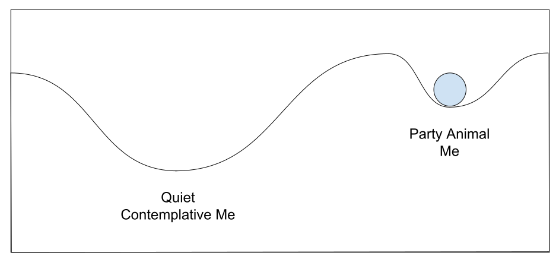
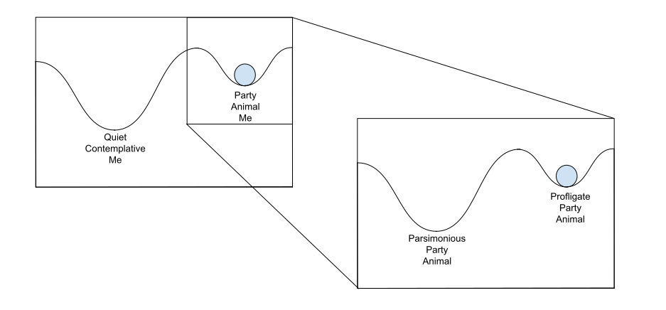

# Vila Real de Santo Antonio Part 1 (Monday 2nd to Wednesday 4th April 2018) #

After Vilamoura, Vila Real de Santo Antonio, or VRSA as it seems to be regularly abbreviated, is quiet and definitely Portuguese. In an earlier blog I told a story of how I have two equilibria; Quiet Contemplative Me and Party Animal me. Since Lagos, I have been firmly in Party Animal mode. I represent these modes on a diagram of a ball that finds a level where it might rest.

 

On the morning after arriving in VRSA I lie in my cabin while the Riffraff sleep. Since arriving I have stowed the mainsail, that was taking up so much space, in the aft locker and now once again I can starfish on my bed, stretching out my arms and legs in the early dawn light. Around me I have all the things I might need as I while away the hours before the others wake. Next to me is my laptop, tablet and phone for which I have run in power lines so I can keep them charged. On top of my notebook and pen is my tobacco, papers and filters together with a portable ash tray. I sit up and role a cigarette then open the hatch, stand on my bed and poke my head out. I light the cigarette and survey the world around me. 

I reflect that I have lived much of my life as a Party Animal. If you were to look on social media you would find many images of me, bottle of Prosecco in hand, surrounded by friends all enjoying ourselves. Much of this was enabled by having a well paying job. Now, without employment, this lifestyle is harder to maintain. Since the Riffraff arrived we have been eating out and drinking in bars and this has taken its toll on my budget. Even in my partying heyday there was still had a hint of financial control, as I generally chose to drink Cava and Prosecco rather than Champagne. Here I think, could be the solution to my current budgetary problems. As I stub out the last of my roll up, I mentally drill down on my Party Animal equilibrium to find, when I look more closely, there are two equilibria here.  

I can be a Profligate Party Animal, drinking in bars or cafes or still have almost as much fun with Riff and Raff, by cooking on the boat and drinking cheap supermarket beers. As I close the hatch I hear Riff's voice coming through my cabin door. I venture out from my nest and after making tea and coffee recount my thoughts to the crew. It turns out they have the same problem so, after showering, we try to shift our equlibrium by heading out to the supermarket to stock up on food and beers which the Riffraff kindly buy.

We head back towards the boat, hefting our shopping in the midday sunshine, and all is going well with our plan until we spy, sitting at a bar, the sailor who had helped us moor the day before. Of course we soon join him in the Portuguese shade and spend an afternoon swapping stories and plans.

Ertan, as our new friend is called, is British of Turkish descent. He has spent years running a business that literally, tailored, to the UK military's upper echelons. Now he is spending time out sailing. His plans put my little voyages to shame. In June he is entered in the [Golden Globe round the world race](http://goldengloberace.com/). This will involve around 300 days at sea to celebrate [Sir Robin Knox-Johnston's](https://en.wikipedia.org/wiki/Robin_Knox-Johnston) first solo non-stop circumnavigation. The race is limited to a set of long keel yachts and the sailors are precluded from using any form of electronic navigation, not even a digital watch! The electronics stipulation is to recreate the conditions of Knox-Jonhston's original sail. 

On Kite we have multiple devices that use Global Positioning Satellites (GPS) to determine our latitude and longitude. Ertan will have no such luxury. He will have to rely on paper charts and a sextant, the traditional device that lets you determine your position on the ocean by measuring the angle between the horizon and a celestial body such as the sun. The technique relies on a set of complicated calculations and a nautical almanac. The almanac consists of a set of tables that detail the position of the sun, moon, planets and stars for a particular date and time. Part of me is appalled at this prospect but I also envy the opportunities Ertan will have, without all the electronics, for just being there at one with the ocean.

We think about eating out, but then remember our plan and the shopping bags around us. We invite Ertan back for dinner and he heads back to his boat to deal with some stuff while I rustle up a broccoli and cauliflower cheese. Our guest arrives as my dish is browning in the oven. In his hands are dishes of pasta and garlic bread. The four of us sit in Kite's main cabin eating the shared food and drinking our supermarket beers while swapping more stories. So we at least partially execute our plan.

Early the next morning while the Riffraff sleep, awake again, I sneak out of my forward cabin to grab my book on celestial navigation that I was so kindly given when I left my job at JP Morgan. Back in my bed I study the techniques with my notebook and pen. Later, when I am walking back to Kite from the marina office, Ertan invites me aboard the Lazy Otter, the Rustler 36 on which he will attempt his circumnavigation. Over tea we I get to examine his sextant and nautical almanac as we discuss the calculations involved in fixing a position without GPS. Our conversation turns to other things and it is not long before we are discussing Brexit.

Ertan voted to leave. He explains his decision around the single issue of [Abu Hamza](https://en.wikipedia.org/wiki/Abu_Hamza_al-Masri) the former imam of Finsbury Park Mosque in London. He objected to the European Courts preventing the then Home Secretary, Theresa May from extraditing Hamsa to the United States. I rejoin that it is the job of the courts to keep ministers in check. We discuss the likely impact that the loss of freedom of movement will have, particularly on the young people of Britain. The conversation is delicate and respectful. In the end I sense that Ertan may be changing his mind about Europe but that may be wishful thinking on my part. 

The wind is changing and is set fair for my friend's sail Westwards to Lagos and then on back to the UK for the start of his race. He plans to leave in the morning. I promise to help, knowing that I will almost certainly be awake. The next day I sleep in and wake at 7:30 to find Ertan and the Lazy Otter gone. I am sad not to have said goodbye but mentally I wish them both fair winds.

[Creative Commons Attribution-NonCommercial-ShareAlike 4.0 International License](href="http://creativecommons.org/licenses/by-nc-sa/4.0/).
