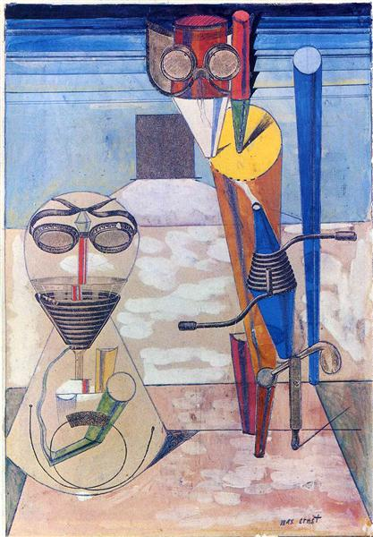

# Vila Real de Santo Antonio Part 2 (Wednesday 4th to Thursday 5th April 2018) #

Time in Vila Real de Santo Antonio is a fluid thing. Portugal shares a time zone with the UK whereas Spain is an hour ahead on the same time as France and Germany. Our phones switch time as they roam depending on the mobile company they select. My laptop identifies the Spanish  Ayamonte, across the river, as the nearest large town and rigidly runs on Spanish time. My cheap digital watch maintains it's usual stubbornness and sticks to the Portuguese hour, despite any amount of button pressing. 

On Wednesday the RiffRaff and I decide to take a trip to Spain. It is only a short ferry ride across the Guadiana river. We take our passports but as both Spain and Portugal, and indeed most of the rest of Europe are in the [Schengen Area](https://en.wikipedia.org/wiki/Schengen_Area) they are not needed. The border is as frictionless as crossing the river Dart the previous July.

We walk around the town of Ayamonte for a while and then settle outside a bar in the main square where we we drink *cerveza* (not *cerveja* as we would have done in Portugal) and eat tapas. I trip up frequently saying the Portuguese *Obrigado!* rather than the Spanish *¡Gracias!* when thanking the waiters. They smile understandingly at me as I apologise first in Portuguese and then correct myself to the Spanish. The Riffraff and I talk about the [Freekuency](http://www.freekuencyfestival.com/) festival to which we are all supposed to be going at the weekend. I warn them that party animal me may be all played out but they are having none of it.

The last ferry across the river is at 8 o'clock Spanish time. I decide to catch it leaving the Riffraff to their own adventures. As I walk away from the bar I don my headphones and carry on listening to one of [Stephen West's Philosophize This Podcasts](http://philosophizethis.org/). On the return crossing, with the sun setting over Portugal in front of me, and Spain retreating behind me, I fall deeply in love with a French writer and philosopher who died when I was 24 years old.

[Simone de Beauvoir](https://en.wikipedia.org/wiki/Simone_de_Beauvoir) was known for her novels and a seminal text on feminism [The Second Sex](https://en.wikipedia.org/wiki/The_Second_Sex), but it is another of her works, [The Ethics of Ambiguity](https://en.wikipedia.org/wiki/The_Ethics_of_Ambiguity), that now grabs my attention. In it she talks of human beings human beings existing in in a world of opposites, of dualities, that we are torn between. We ask ourselves am I:

* An individuals or member of a group.
* Defined by my nature or by how I was nurtured.
* Mind or matter.
* Quiet and contemplative or a party animal.

As West notes we could go on forever defining these dualities. De Beauvoir believes that these opposites create the ambiguity of our existence because typically, in each case, we are neither one thing nor the other but both. Back on Kite I do some more reasearch and find the following [quote](https://www.goodreads.com/work/quotes/1257058-pour-une-morale-de-l-ambig-it) from the Ethics of Ambiguity, published in 1947, just after the second world war (I stumble on the word *exigencies* so look it up to find that it means *urgent needs or demands*):

> *“Men of today seem to feel more acutely than ever the paradox of their condition. They know themselves to be the supreme end to which all action should be subordinated, but the exigencies of action force them to treat one another as instruments or obstacles, as means. The more widespread their mastery of the world, the more they find themselves crushed by uncontrollable forces. Though they are masters of the atomic bomb, yet it is created only to destroy them. Each one has the incomparable taste in his mouth of his own life, and yet each feels himself more insignificant than an insect within the immense collectivity whose limits are one with the earth's. Perhaps in no other age have they manifested their grandeur more brilliantly, and in no other age has this grandeur been so horribly flouted. In spite of so many stubborn lies, at every moment, at every opportunity, the truth comes to light, the truth of life and death, of my solitude and my bond with the world, of my freedom and my servitude, of the insignificance and the sovereign importance of each man and all men.”* 

I reflect that in some ways this ambiguity of not knowing who we are is a scary prospect, but it is also that from which our freedom as a human being springs. As a child our world seems certain, things are explained by our parents who seem godlike in their knowledge. As we grow older we gain more freedoms but, some of us, at least, begin to sense this ambiguity and find it troubling compared to the certainty of childhood. To [quote](https://www.goodreads.com/work/quotes/1257058-pour-une-morale-de-l-ambig-it) De Beauvoir:

> *“Therefore the misfortune which comes to man as a result of the fact that he was a child is that his freedom was first concealed from him and that all his life he will be nostalgic for the time when he did not know it's exigencies.”*

De Beauvoir identifies different types of human being by how they respond to this notion of ambiguity. I identify most with the *Truly Free* who are defined as having three key attributes:

* Recognising the ambiguity of their existence.
* Creating their own values and goals.
* Willing the freedom of others.

In her own [words](https://www.goodreads.com/work/quotes/1257058-pour-une-morale-de-l-ambig-it):

> *“Man must not attempt to dispel the ambiguity of his being but, on the contrary, accept the task of realizing it.”* 

and:

> *“A freedom which is interested only in denying freedom must be denied. And it is not true that the recognition of the freedom of others limits my own freedom: to be free is not to have the power to do anything you like; it is to be able to surpass the given toward an open future; the existence of others as a freedom defines my situation and is even the condition of my own freedom. I am oppressed if I am thrown into prison, but not if I am kept from throwing my neighbor into prison.”*
 
I am happy but also strangely tired. After a quick clean of the boat and myself, I slip into bed and am soon fast asleep. I wake early in the morning needing the toilet. When I return I lie under my warm covers and wonder if I am truly free, do I really will the freedom of others? I recall my writings and the planned theme of freedom. Maybe it will influence someone. I have spent so much time having fun with Riff and Raff that I have neglected this work. All of a sudden my mind is made up, there will be no Freekuency festival for me. When the others wake I let them know that I am definitely not coming.

Later in the day the Riffraff take the train to Faro where they will pick up another friend before heading onto the festival. I walk with them, helping carry the loaned tent. I wave them off and on the way back give myself the luxury of watching Arsenal play CSK Moscow in a local bar. I settle down to my writing the next day.

[Creative Commons Attribution-NonCommercial-ShareAlike 4.0 International License](href="http://creativecommons.org/licenses/by-nc-sa/4.0/).
