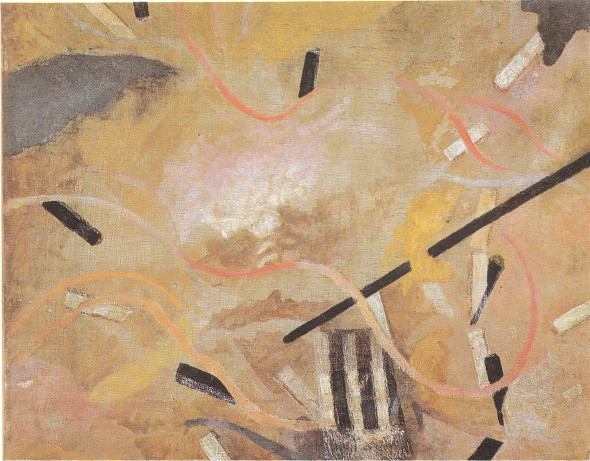
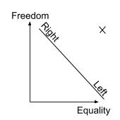

# Vila Real de Santo Antonio Part 3 (Friday 6th to Friday 13th April 2018) #

I wake early on Friday and press on with my writing. I set up my desk by bringing out the extra monitor, laptop stand, keyboard and mouse. I connect up all the cables and pull out the small office chair that I keep on Kite. With my rough notes and a cup of tea in front on me, I am ready to go. By lunchtime I have completed one piece and sketched the outlines of a few others. 

My brain feels pretty fried so I decide to focus on a boat chore for a couple of hours. I strip all the beds, stuff the bed linen into a bag and head out to find a laundrette. This is only a short walk away and soon I am watching sheets, duvets and pillow cases turn this way and that while listening to [Stephen West's](http://philosophizethis.org/) third podcast on Simone De Beauvoir. The focus is on what De Beauvoir calls *The Aesthetic Attitude* - the idea that it is possible to comment objectively about our world. 

As an existentialist philosopher, building on [Heidegger](https://en.wikipedia.org/wiki/Martin_Heidegger) and consistent with her life partner [Jean-Paul Sartre],(https://en.wikipedia.org/wiki/Jean-Paul_Sartre), Simone De Beauvoir believes that [Existence precedes essence](https://en.wikipedia.org/wiki/Existence_precedes_essence). That by being there in the world, by existing, humans determine their own meaning and values rather than being defined as an essence, an object with a set of attributes. We are each free individuals and there is no absolute set of rules by which we can be compared or judged.  

The consequence of this view is that it is impossible to comment objectively about the world. There are no sets of rules that can ground that objectivity. All that can be done is to to write and make it clear, as best we can, who we are and where we come from, our [Facticity](https://en.wikipedia.org/wiki/Facticity) as it were. As I fold my tumbled dried laundry I think about how much this idea gels with some of my writing from the previous year, where I sketched a proof, that all news is, in some sense, fake news.

As I walk back to the boat with my clean washing slung across my shoulder I recall a WhatsApp chat with my son Samuel that I had back in Oerias at the beginning of this voyage. Our conversation was grounding out into question marks and ellipses when I spotted the ruin of an old pillbox. I snapped a picture of it and sent it to him. A discussion ensued about the pillboxes origin and the [Estado Novo](https://en.wikipedia.org/wiki/Estado_Novo_(Portugal)) the regime that ruled Portugal after a military coup d'etat in 1928 until the [Carnation Revolution](https://en.wikipedia.org/wiki/Carnation_Revolution) in 1974. My son pulled me up on my hostility to the regime. At one point he exclaimed that I had:

> *"been influenced by too much Marxist propaganda"* 

Later that day, at the gates to Oeiras marina, I encountered Jorge and struck up a conversation, initially in the local language. It turns out that he had lived in UK and, as he spoke better English than I did the Portuguese, we switched to my mother tongue. I learnt that he lived on his boat in the marina and that he moved to the UK in 1974 because of the political situation. 

> *"They called me a fascist!"* 

he exclaimed with a mixture of sadness and venom. We talked for a while longer until our conversation eventually petered out. He wished me luck on my voyage and we went our separate ways. 

Back on the boat I continue writing and doing little chores over the weekend, all the time Samuel and Jorge's comments come into and out of my mind against a background of Simone De Beauvoir's Aesthetic Attitude. When I wake on Sunday I lie in bed and reflect on what I write. I think some aspects of who I am, my Facticity, will come out in the very nature of the stories that mix the sailing adventures with other thoughts, but there is a whole load of baggage that will not fit naturally into the narrative. Given what I want to say later, I decide that I should make these things explicit and grab my notepad from by my side and start writing.

I grew up in the 1960s and 70s up as an only child living with my two parents and parental grandmother in a large semi-detached house in a North London Suburb. My mother Irene, pronounced, as she would always tell you, eye-reen-eee, hailed from the northern town of Warrington. She came to London in her teens to study drama at the [Royal Academy of Dramatic Art](https://www.rada.ac.uk/). She became a communist and mixed with members of the [International Brigades](https://en.wikipedia.org/wiki/International_Brigades) that had returned from fighting for the republican side in the [Spanish Civil War](https://en.wikipedia.org/wiki/Spanish_Civil_War). As I write my notes I can't help but think that my son Samuel is at least partly right. I remember the joy in our house when Spain returned to democracy in 1975. For me the Estado Novo in neighbouring Portugal had always been tarred with the same brush.

My father Ray was a life long trade unionist and socialist who grew up in the New Forrest. His family could trace their radicalism back to the [Chartist](https://en.wikipedia.org/wiki/Chartism) campaign for universal male sufferage. My grandmother Ethel was born in September 1889 when the London Dockworkers Union were celebrating a historic victory. The speech of one of the dockworkers leaders, [John Burns](https://en.wikipedia.org/wiki/John_Burns), whose name is immortalised on a [Woolwich Ferry],(https://en.wikipedia.org/wiki/Woolwich_Ferry) can usually bring tears of labour pride to my eyes:

> *"This, lads, is the Lucknow of Labour, and I myself, looking to the horizon, can see a silver gleam - not of bayonets to be imbrued in a brother's blood, but the gleam of the full round orb of the dockers' tanner."*

The second world war had a dramatic effect on my parents. My father was conscripted into the Royal Navy and spent five years on a destroyer. My mother gave up acting and built tanks for the war effort. She never returned to the stage. They were were rewarded for their sacrifices when the 1945 general election returned the [Attlee Labour Government](https://en.wikipedia.org/wiki/Attlee_ministry) that created the [National Healh Service](https://en.wikipedia.org/wiki/Attlee_ministry#Health) and the [Welfare State](https://en.wikipedia.org/wiki/Attlee_ministry#Welfare).  

I put my pad to one side and stretch out in the forward cabin. I am about to get up but then think there is a little more I should disclose about my childhood. I was never a [boy scout](http://scouts.org.uk/home/), an organisation with the [motto](https://en.wikipedia.org/wiki/Scout_Motto):

> *"BE PREPARED which means you are always in a state of readiness in mind and body to do your DUTY"*

Instead I was enrolled in the mixed sex [Woodcraft Folk](https://www.woodcraft.org.uk/) who preferred to:

> *"Span the World with Friendship"*

It is not until I write these lines that I realise the profound difference between the two and how much my life has been influenced by the latter.

I pass the rest of the weekend productively and, what is more, by the time the Riffraff return from the festival with their friend Hectic, I haven't had a cigarette for three days. This all comes to an end as we stay up till the early hours of Tuesday morning, drinking and smoking, as I listen to their adventures. 

On Wednesday Hectic and Raff fly back to the UK. Raff has a wedding, but is due to meet us again in Gibraltar in a weeks time. Thursday's weather is terrible so Riff and I stay in the boat. Lying in my cabin I pick up my notes and realise that there is perhaps one thing more to say. We are often asked where we lie on a spectrum between right and left. In my twenties the ends of this spectrum seemed clear to many. Either you were on the left and believed in equality or on the right and believed in freedom. 

These days I believe that freedom and equality are orthogonal, that they both form their own dimension. There is, in my opinion, no need to sacrifice one for the other. I can maintain my radical heritage and strive for both freedom and equality.

[Creative Commons Attribution-NonCommercial-ShareAlike 4.0 International License](href="http://creativecommons.org/licenses/by-nc-sa/4.0/).