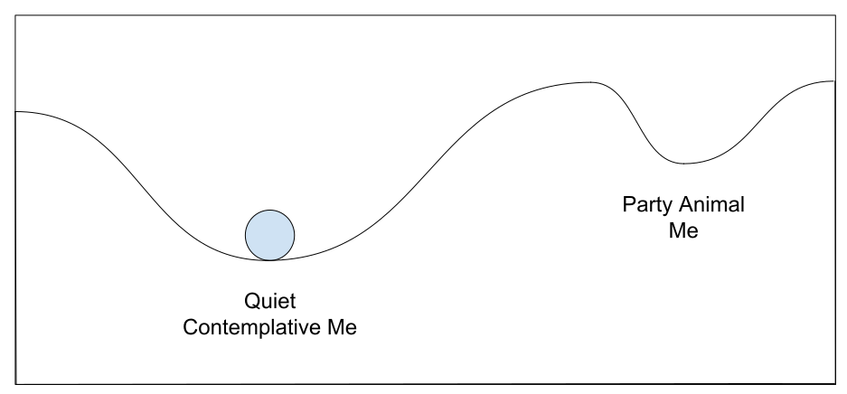

# Cadiz (Saturday 14th to Monday 15th April 2018) #

After our overnight sail Riff and I spend most of our first day catching up on sleep. Early in the day I post on the social media looking for recommendations for Cadiz on a Friday night. By the evening a friend has recommended Taberna Casa Manteca and so we head off into town with this in mind. We are in no hurry though, and walk along the see wall just admiring the view. We come across giant trees that appear to have burst from some psychedelic drawing. We see the sunset over the atlantic from the sea wall and then head in land to find something to eat. 

After circling the old town a few times we eventually come across our recommendation. Taberna Casa Manteca is a Tapas bar with a bull fighting theme, and it is completely rammed. Riff and I decide to dive in and, after about ten minutes of maneuvering, manage to cross the meter from the door to the bar and order a couple of beers. After a while we see some people leaving from a corner and head in that direction. Eventually we are perched sitting on the end of a table where we can also rest our glasses, a pretty comfortable spot considering the fullness of the bar. We dine on excellent tapas and are soon talking and sharing wine and stories to the folks around us; a Frenchman, three Canadians and a Spanish hen party. At times I disengage from the conversation and people watch as the rapid fire of the Spanish language happens all around me, it seems so different from Portugal.

On Sunday Riff heads out to draw the giant trees and I spend the time mostly resting. This is partly enforced as Spain, unlike Portugal tends to close down for normal business on a Sunday. I manage to do some shopping for our next leg but still have a fair amount to do the next day. So on Monday, I am up and out before Riff is awake. As I leave the boat, I put in my headphones and, as I walk along the sea wall into Cadiz, I listen to tunes, occasionally interrupted by Google Maps directions. I haven't gone far when Maps starts to irritate the hell out of me by mangling the pronunciation of the Spanish street names. I take a bold step and switch my phone to Spanish. I am pleasantly surprised as I learn that Spanish for left and right (izquierda y derecha) sound pretty much like the Portuguese (esquerda e direita) and soon the directions in Spanish are making sense. It seems that in learning some Portuguese I have got some Spanish for half the effort.

I'm at Lidl before it opens. I worry briefly that I'm turning into my parents who would always get to the supermarket early to "avoid the rush". This rush, is of course, caused by all the retired folks with exactly the same plan. Generally I prefer to rock up an hour later when the early crowd have all gone home. This however is Spain and everything seems to start a little later. 

I return to a cafe I had seen earlier and impress myself by ordering a "descafeinado con leche" without resorting to English. I sense that although I was understood my pronunciation may be a little ropey. So, as I sit and drink my coffee, while I wait for Lidl to open, I study the details of Spanish pronunciation on my phone. I learn that *a* is the same in both languages and pronounced *ah* and indeed most of the vowel sounds are similar. There are more differences amongst the consonants *j* is a *zh* sound in Portuguese but a *h* sound in Spanish.

With my coffee finished I sit back and roll another cigarette and think about the things that stay the same as I transform from Portuguese to Spanish. These are what mathematicians call [Fixed Points](https://en.wikipedia.org/wiki/Fixed_point_(mathematics)). I finish my cigarette, thank the waiter and head off to the supermarket where more fixed points await me. 

There is a Lidl within a few hundred meters of my home in London, and as it's the nearest supermarket, I have used it for much of my shopping. Lidl, it appears, is pretty ubiquitous across Europe. As I tour my first Spanish incarnation I notice the piles of Bacalhau, the salted codfish so beloved of the Portuguese, have gone and the freezer cabinets have much less seafood in general. The fixed points are the standard Lidl products; the kitchen roll, the shampoo the [MSC](https://www.msc.org/) prawns. Also there are many new things. The supermarket seems to have much more choice than it's Portuguese counterparts. I'm overjoyed when I find Kale in the vegetable section, a food that I haven't seen since the UK.

My last mission involves updating the mobile internet that we have on the boat. There are few fixed points here. Mobile internet in Portugal is cheap and good. Unlimited 4G can be had for €30 a month. Sim cards can be bought over the counter without hassle. In Spain, internet is more expensive, 6 gigabytes for €20 and every sim bought must be tied back to an identity document or passport. This is a laborious process that seems to take on average about 15 minutes. I ask in the mobile phone shop why Spain has this requirement and am told that it is for security. It seems like knee high security to me. It creates a wall just big enough for most people to trip over but any individual trying to circumvent the process could easily step over the wall.

With a new sim card for my mobile internet device I head back to the boat and as I do I think of another fixed point. This time it is mathematical in nature and relates to the idea of Basic Income and Simple Tax (BIST), that occupied my nighttime hours on the sail to Cadiz (see Appendix 1). As I get nearer the boat I wonder if there have been any more fixed points in my story. Of course I think the, two equilibria that I exhibit can be thought of as fixed points:

They are points that stay fixed as time changes. Places where I will rest unless another force acts upon me.

[Creative Commons Attribution-NonCommercial-ShareAlike 4.0 International License](href="http://creativecommons.org/licenses/by-nc-sa/4.0/).