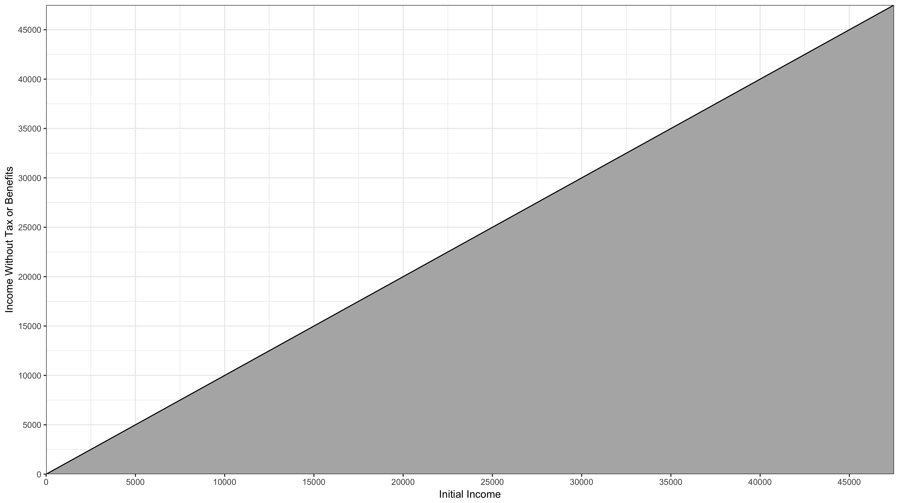
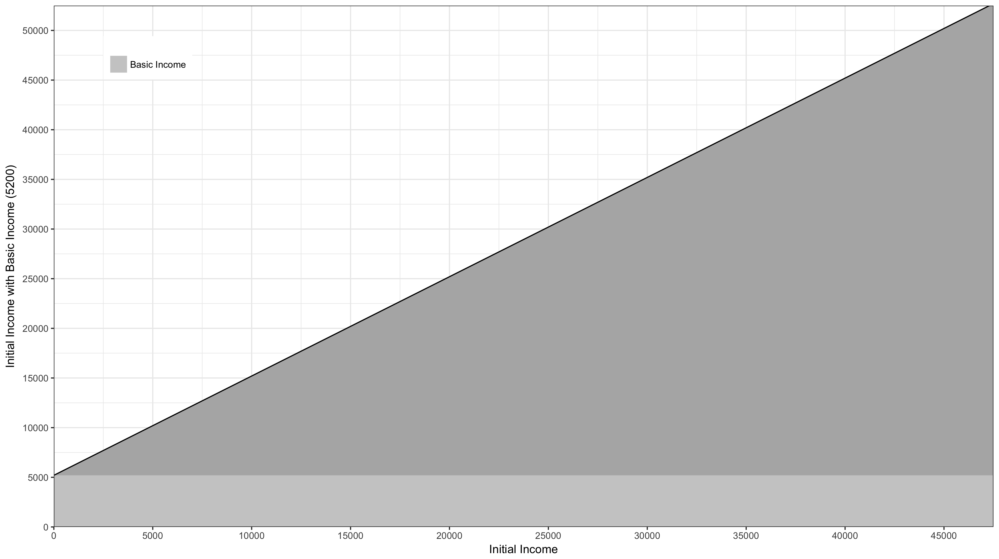
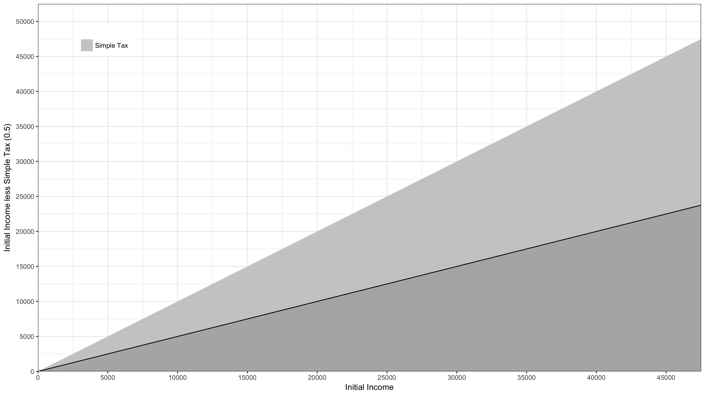
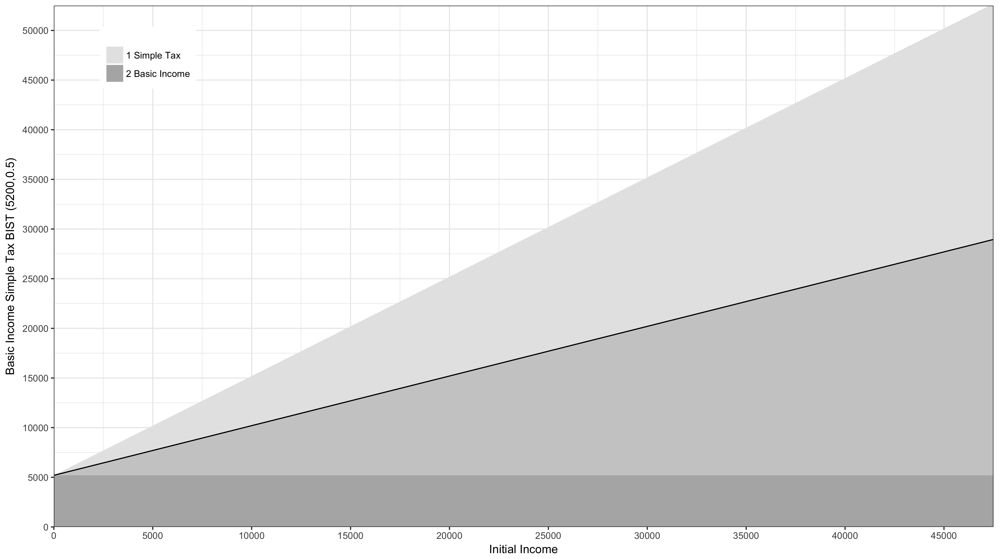

# Appendix 1: Basic Income Flat Tax - BIST #

In the dead of night I sit on Kite with some graph paper an  d draw a line across the page.

The line represents shows what income people would have if there were no benifits and nof forms of income tax or national insurance. They would, of course, get exactly their intial income. I turn the page and draw another almost identical graph but this time I add a [Universal Basic Income](https://en.wikipedia.org/wiki/Basic_income) component:

This is an idea that has been gaining prominence recently. A Basic Income is a payment made to everyone no matter what their initial income. In the graph above this income corresponds to 100 pounds a week or put another way £5200 a year. On the opposite page of my pad I draw another graph:

This represents a very [simple way of taxing income](https://en.wikipedia.org/wiki/Flat_tax), where everyone pays the same rate no matter what they earn. In this case the rate is 0.5 (or 50%). So if you earn £10,000 you pay half of this (£5000) in tax and receive the other half (£5000) as income.

What I'm thinking about now as Kite sails quickly but quietly down the Spanish coast in the dead of night, is combining these two ideas. I turn the page in my pad and, regularly flicking back to the previous pages, draw the combined graph:

This I label Basic Income Simple Tax which I abbreviate to BIST. My latest graph shows how BIST is constructed, but I can't help but feel it doesn't present the whole picture, so on the opposite page, I draw another graph:

The graph shows, those on lower initial income being supported wheres those on higher incomes contribute. 

There is nothing particularly original about the idea of Basic Income and Simple Tax, however I believe it offers the ability to grant human beings a great freedom; the freedom to move in time. It has the potential to free us from the cage of employment, from wage slavery as it were. I have discussed Basic Income and Simple Tax with many people over the years but I have never felt more strongly about it than I do now. In the coming days of sailing I want to develop the arguments to in support of this mechanism, tell the stories to illustrate that this idea not only brings massive potential benefits but is also very easy to implement.