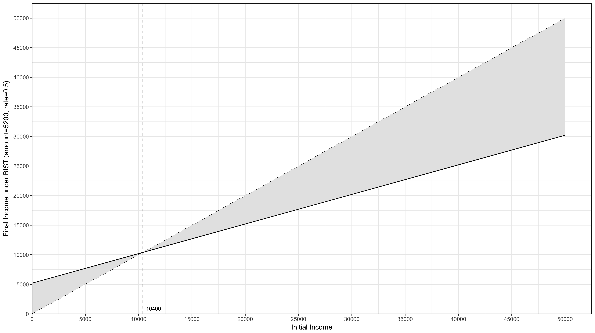

## BIST Fixed Points ##

While wandering around Cadiz I thought about the notion of fixed points. One of these was mathematical in nature and relates to the idea of Basic Income and Simple Tax (BIST), that occupied my nighttime hours on the sail to Cadiz. On this journey I had completed my thoughts on the subject by drawing a graph of the final income resulting from a BIST system against the initial income. I redraw that graph in my head now and identify the one fixed point, where the amount received after BIST is the same as when there is no intervention. In other words it is the point at which a person would pay no tax and receive no benefit:

In our example the fixed point is 10400 which is equal to 5200/0.5. This generalises and for any BIST with a basic income *amount* and a income tax *rate*. The 'break even' fixed point will be at *amount/rate*. This notion of fixed point will become handy in at least one of the arguments to follow 
