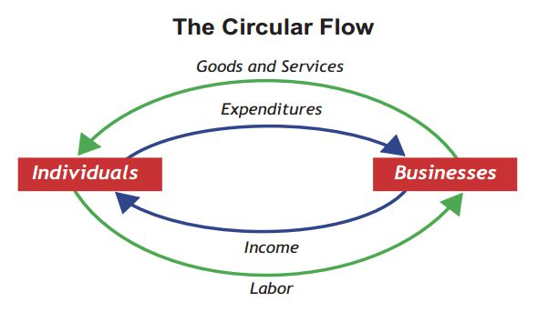
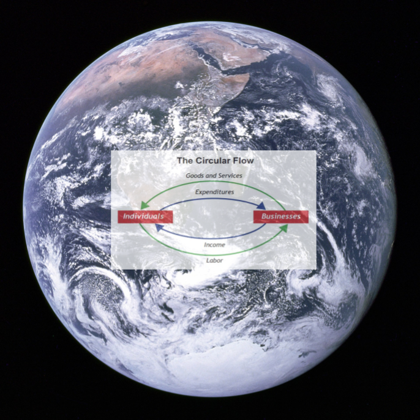
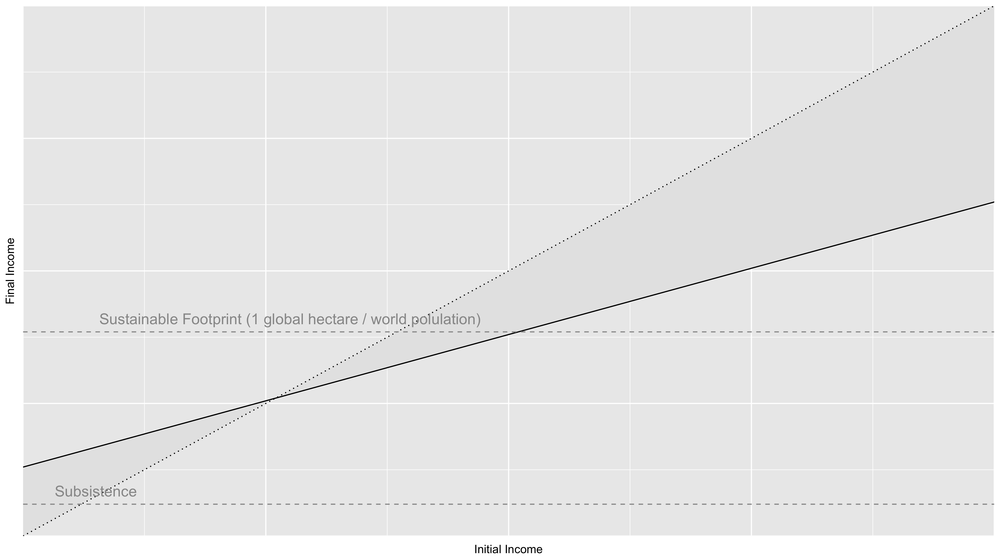

## BIST: The Environmental Argument ##

While Riff and Raff watch the Tottenham play Man United in the FA cup semi final at the [Verdemar Ecologistas](https://www.facebook.com/pg/verdemarecologistas/photos/?ref=page_internal) in San Roche, and our new friends are off chatting with others I start thinking about the impact BIST could have on the environment. I start by thinking about a simple model of the economy that is known as the [Circular Flow of Income](https://en.m.wikipedia.org/wiki/Circular_flow_of_income):

Here Households provide Labour to Businesses in return for the Income in the form of wages, whereas Businesses provide Goods and Services for income in the form of household Expenditure. 

The idea can be traced back to [Richard Cantillon](https://en.m.wikipedia.org/wiki/Richard_Cantillon) but in many ways came to the fore with [John Maynard Keynes](https://en.m.wikipedia.org/wiki/John_Maynard_Keynes) in particular his work [The General Theory of Employment, Interest and Money](https://en.m.wikipedia.org/wiki/The_General_Theory_of_Employment,_Interest_and_Money).

Keynes was writing in the 1930's and his principal concern was the [The Great Depression](https://en.m.wikipedia.org/wiki/Great_Depression), that period of economic collapse that had followed the 1929 stock market crash and had led to mass unemployment across the the world. Keynes sought to demonstrate that the amount of income in the circular flow of income could settle at different equilibria. In particular, he showed that in the 1930's, the equilibrium was well below full employment. He identified a number of actions called injections that introduce income into the flow:

* Investment
* Government Expenditure
* Exports

There are opposite actions are called leakages and withdraw from the flow of income:

* Saving
* Taxation
* Imports

Keynes argued that it was possible to move the circular flow of income to a new equilibrium by increasing the injections and reducing the withdrawals, thereby reducing unemployment. His approach provided an justification for governments to run a deficit where taxation fell short of government expenditure in order to stimulate the economy. It essentially provides an argument for government intervention in economic affairs.

The Keynesian approach dominated economic policy from the end of the second world war until the 1980's when it was superseded by the [Monetarism](https://en.wikipedia.org/wiki/Monetarism) which adopted the basic tenets of Keynesianism, including the Circular Flow, but argued that the equilibrium levels are better adjusted by paying attention to the money supply through controlling interest rates, rather than using fiscal policy that focused on government spending and taxation.

I pause for a minute remembering the political landscape of my youth, where [Margret Thatcher](https://en.wikipedia.org/wiki/Margaret_Thatcher) in the UK and [Ronald Regan](https://en.wikipedia.org/wiki/Ronald_Reagan) in the US wrought massive change on the economies of their respective countries by adopting monetarist policies. Then I look up I remember where I am and bring back my focus to The Environment.

The important point for me is that the circular flow of income doesn't occur in a vacuum, but rather in our very real environment:

NOTE: This can be replaced with a diagram based upon a picture in the George Monbiot stuff from Kate Raworth

From the beginning of the industrial revolution humanity has been dramatically increased their power over the environment through increased productivity. This has enabled the population to grow from around 1 billion in 1800 to around 7 billion today, lifting many out of poverty in the process. As is often said, with great power becomes great responsibility. As the effects of our power begin to be felt on a planetary scale not least through [Climate Change](https://en.wikipedia.org/wiki/Climate_change), I believe that we should begin to take responsibility for our actions.

One way of understanding our impact is through [Ecological Footprint](https://en.wikipedia.org/wiki/Ecological_footprint) analysis, which measures the amount of space that is required on the planet to sustainably support the materials we consume and the waste we create. The footprint is measured in [Global hectares](https://en.wikipedia.org/wiki/Global_hectare). It is estimated that human activity currently consumes 1.6 global hectares. In other words human beings are having 1.6 times more impact on the planet than is sustainable.

Many of us try to reduce our environmental impact in our everyday lives, we recycle, we eat less meat, take less flights and buy ecological products. This will make the situation better but its impact is dwarfed by our income. As this [Vox article](https://www.vox.com/energy-and-environment/2017/12/1/16718844/green-consumers-climate-change) states:

* *"Study after study finds that the primary determinant of a person’s actual ecological footprint is income."*

In other words there is a strong correlation between income and ecological footprint. Given this, it is possible to express a sustainable footprint as around $10,800 per year [PPP](https://en.wikipedia.org/wiki/Purchasing_power_parity) (Global World Product per capita at PPP - $17,300 / Currently used Global Hectares - 1.6 ). Of course not every dollar spent has the same ecological impact, though perhaps this is something we should aim for through differential taxation. However, given there is a close correlation, relating ecological footprint and income in this way doesn't seem entirely inappropriate.

Subsistence level can also be expressed in dollar terms. At the time of writing the World Bank [estmates](https://en.wikipedia.org/wiki/Poverty_threshold) the poverty line to be at $1.90 per day PPP. In annual terms subsistence equates to an income of around $700 a year.

Since both Sustainable Footprint and Subsistence can be expressed in terms of income, they can be plotted against the Basic Income Simple Tax graph.

I would argue that a humane society would provide a Basic Income above subsistence level and below the sustainable footprint. The simplification of the tax and benefit systems provide by BIST makes it obvious the simple levers that could be used to ensure that the human population uses its enormous economic power in a sustainable fashion. Basic Income acts as an injection to the economy provided to each and every person, the simple taxation acts as a withdrawal. By choosing an appropriate level for these two quantities, as well as other injections and withdrawal we could aim to keep human activity at one global hectare.

It is all too easy to get depressed about the current state of the world and feel that we are all doomed. However, for me, the space that exists between subsistence income and sustainable footprint, that gap between $700 and $10,800, gives me enormous optimism. It is a space that even allows us to maintain our left and right policy differences while living sustainably. The left, who traditionally favour equality would typically adopt a higher basic income and higher rate of simple tax. When I look at the protectionist american right of today and free trade right of the Regan era - the only thing I see in common is the tax cuts for the rich. Consequently I believe the right would aim to minimise basic income and the rate of simple tax. Though I suspect with a system as transparent as BIST the right may have more trouble making their case.

There is another impact of thinking about BIST in an ecological context, it places those on lower incomes in a different light. In a world without environmental constraints, one who doesn't make a net income contribution to society is often demonised. In a limited environment, however, the same person can be lauded as hero, since there ability to get by on less than the ecological footprint is what enables others to have more than their fair share of the planets resources.

 

The ecology problem. How can I do right 

Ecological Footprint

Wakernagel and Reece

Correlation of Cash with Environment -

Subsistence Level
Basic Income
Ecological Footprint - Sustainability Level

and I can't help as I look around me at the efforts of the Ecologistas, [Marine Debris](https://en.wikipedia.org/wiki/Marine_debris))

Good Monbiot stuff: https://www.theguardian.com/commentisfree/2017/apr/12/doughnut-growth-economics-book-economic-model

Economics and Inequality:

https://www.theguardian.com/inequality/2017/jul/04/is-inequality-bad-for-the-environment

https://www.theguardian.com/environment/2015/nov/02/inequality-is-not-just-bad-economics-its-bad-for-the-planet-too
