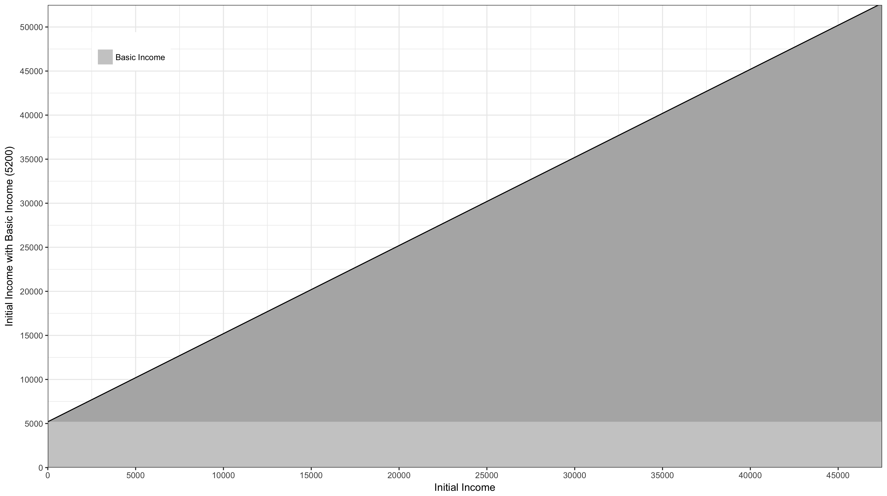
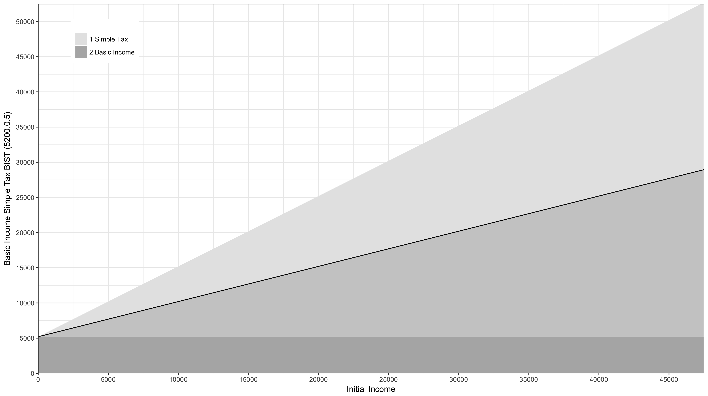
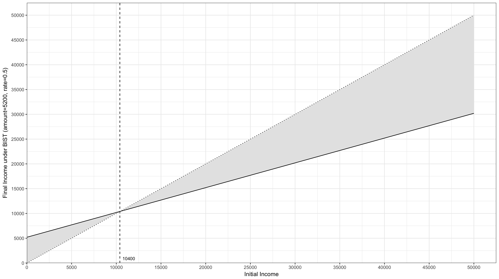

# Appendix 1: Basic Income Flat Tax #

In the dead of night I sit on Kite with some graph paper and draw a line across the page.

The line represents shows what income people would have if there were no benifits and nof forms of income tax or national insurance. They would, of course, get exactly their intial income. I turn the page and draw another almost identical graph but this time I add a [Universal Basic Income](https://en.wikipedia.org/wiki/Basic_income) component:

This is an idea that has been gaining prominence recently. A Basic Income is a payment made to everyone no matter what their initial income. In the graph above this income corresponds to 100 pounds a week or put another way £5200 a year. On the opposite page of my pad I draw another graph:

This represents a very [simple way of taxing income](https://en.wikipedia.org/wiki/Flat_tax), where everyone pays the same rate no matter what they earn. In this case the rate is 0.5 (or 50%). So if you earn £10,000 you pay half of this (£5000) in tax and receive the other half (£5000) as income.

What I'm thinking about now as Kite sails quickly but quietly down the Spanish coast in the dead of night, is combining these two ideas. I turn the page in my pad and, regularly flicking back to the previous pages, draw the combined graph:

This I label Basic Income Simple Tax which I abbreviate to BIST. My latest graph shows how BIST is constructed, but I can't help but feel it doesn't present the whole picture, so on the opposite page, I draw another graph:

The graph shows, those on lower initial income being supported wheres those on higher incomes contribute. 

There is nothing particularly original about the idea of Basic Income and Simple Tax, however I believe it offers the ability to grant human beings a great freedom; the freedom to move in time. It has the potential to free us from the cage of employment, from wage slavery as it were. I have discussed Basic Income and Simple Tax with many people over the years but I have never felt more strongly about it than I do now. In the coming days of sailing I want to develop the arguments to in support of this mechanism, tell the stories to illustrate that this idea not only brings massive potential benefits but is also very easy to implement.

## BIST Fixed Points ##

While wandering around Cadiz I thought about the notion of fixed points. One of these was mathematical in nature and relates to the idea of Basic Income and Simple Tax (BIST), that occupied my nighttime hours on the sail to Cadiz. On this journey I had completed my thoughts on the subject by drawing a graph of the final income resulting from a BIST system against the initial income. I redraw that graph in my head now and identify the one fixed point, where the amount received after BIST is the same as when there is no intervention. In other words it is the point at which a person would pay no tax and receive no benefit:

In our example the fixed point is 10400 which is equal to 5200/0.5. This generalises and for any BIST with a basic income *amount* and a income tax *rate*. The 'break even' fixed point will be at *amount/rate*. This notion of fixed point will become handy in at least one of the arguments to follow 

## The Simplicity Argument ##

In the night we sail towards the Gibraltar Straights I stare at my written notes notes on the [UK Tax system for 2016/17](https://www.gov.uk/government/publications/rates-and-allowances-income-tax/income-tax-rates-and-allowances-current-and-past). My goal is to illustrate the simplicity of Basic Income Simple Tax relative to the existing UK system. Given this intention it is acceptable for me to simplify my presentation. For, if I can show that BIST is significantly simpler than a simple version of the UK system, then I have certainly shown that it is simpler than the actual system.

My first simplification is only to consider the following components:

* Income Tax
* National Insurance
* Universal Credit
 
It is my intention to describe each one of these in a little detail to prove my point. 

### Income Tax ###

The calculation of 2016/17 UK Income Tax depends upon a personal allowance which is a constant £11500 until income reaches £100,000 when it is withdrawn at a rate of 1 £ for every £2. I ignore married couples and blind persons allowances as a simplification and draw a graph of the Personal Allowance in my pad:

Based on the personal allowance there are a set of tax bands for which tax rates apply:

* From 0 income to the personal allowance: 0%
* For the first £33,500 after the personal allowance: 20%
* From £32,000 to £150,000: 40%
* Beyond £150,000: 45%

These tax rates are actually different for dividend income, but I ignore this as a simplification and after some, not inconsiderable, working out draw the following graph of Initial Income less Income Tax:

This shows initial income with income tax subtracted. Note the bumps in the line. These represent points where different rates apply as well as where the personal allowance is gradually withdrawn. 

### National Insurance ###  

National Insurance was added to the UK system by the [1945 Atlee Labour Government](https://en.wikipedia.org/wiki/Attlee_ministry) as the means to pay for the the Welfare State. It was an approach that has been copied worldwide.  

There are different class of National Insurance contribution. Class 1 contributions are paid out for employees working for an employer. As a simplification I ignore all other classes of contribution, contracted out pensions and reduced rates for apprentices and the young.

National insurance is paid by both employers and employees. For employee contributions there are two of thresholds that matter:

* Primary Threshold of £8164 where employees start contributing at 12%
* Upper Earnings Limit of £45000 above which employees contribute at 2%

Again I spend time calculating so that I can draw the graph of Initial Income less Income Tax and Employees National Insurance:  

### Universal Credit ### 

[Universal Credit](https://en.wikipedia.org/wiki/Universal_Credit) was introduced by the [Coalition Government](https://en.wikipedia.org/wiki/Cameron%E2%80%93Clegg_coalition) in 2013. It aims to simplify the benefit system and incentivise work by integrating a number of existing benefits.

I look at the notes in my note pad and remember how complicated universal credit it is to calculate. However after a while I see that, if I just consider the case of a single person, with no children, who is over the age of 25 and all of whose income is earned, then I only need to worry about:

* A Standard Allowance of £4461.84 annually.
* The Earned Income Taper which reduces universal credit by 63 pence for every £1 earned.

With this information I draw a new graph in my pad which takes into account the effects of Income Tax, Employees National Insurance and Universal Credit. In doing this I change the scale to focus in on the impact of Universal Credit: 

### Conclusion ### 

The graphs created so far in the simplicity argument can be combined to see the effect tax, national insurance and universal credit have on initial income:

 

Spot the similarity with the Final Income under BIST graph.  Just to check I draw another a picture of BIST this time with the amount set to the Universal Credit Standard Amount of £4461.84 and a rate of 0.37. 

 

BIST is more generous to the poor, but otherwise seems to simulate the UK system pretty closely, at least at incomes below £50,000.

I am truely staggered that something built from a *personal allowance*, *withdrawal rate*, *tax thresholds and rates*, *national insurance thresholds and rates*, *universal credit allowances* and *tapers* can be simulated so closely with just an *amount* and a *rate*. Some might argue that the UK system gives greater control and while this is undeniably true, I would question whether such control is really needed. On the other hand the relative simplicity of Basic Income Simple Tax approach seems undeniable.

YOU ARE HERE!!!!!!!

Save this stuff for another agrument about marginal rates 

Can we not survive on a simple standard rate of tax? Is there any good reason in the current system that 

* someone who earns £5000 a year gets 37 pence for each extra pound earned 

while 

* someone getting £7500 gets to keep the whole pound,

or, at the other end of the scale

* someone earning £110,000 gets to keep 38 pence

while

* someone earning £125,000 gets to keep 58 pence?  

